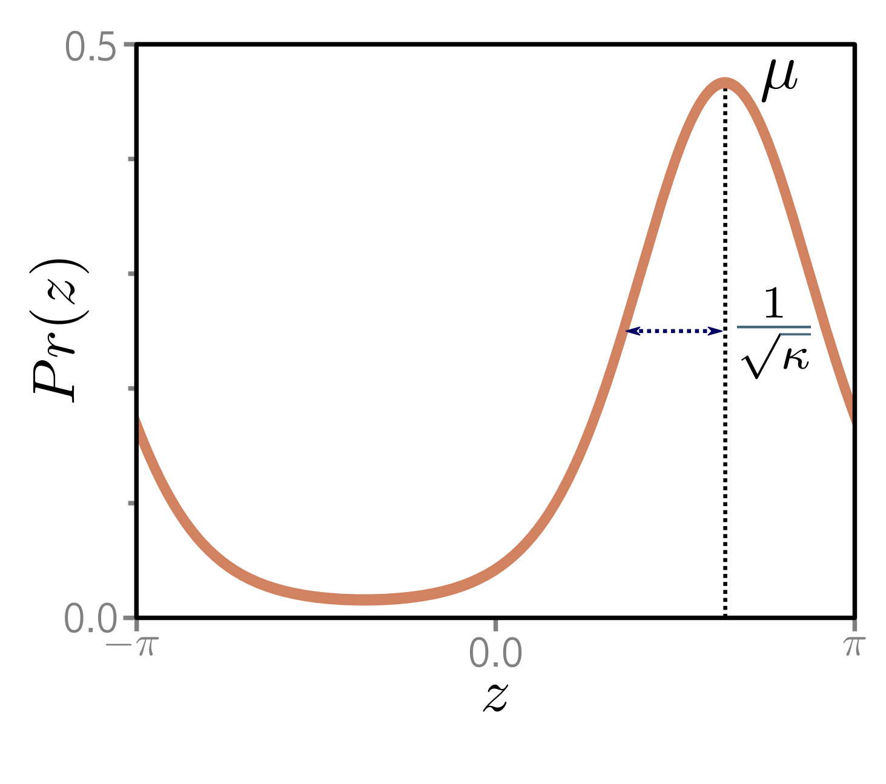

  

  <strong>Figure 5.13</strong> The von Mises distribution is defined over the circular domain ( $-\pi, \pi$ ]. It has two parameters. The mean  $\mu$  determines the position of the peak. The concentration  $\kappa > 0$  acts like the inverse of the variance. Hence 1/ $\sqrt{\kappa}$  is roughly equivalent to the standard deviation in a normal distribution.

**Figure 1**

(see figure 5.14) that is conditional on the input. Prokudin et al. (2018) used the von Mises distribution to predict direction (see figure 5.13). Fallah et al. (2009) constructed loss functions for prediction counts using the Poisson distribution (see figure 5.15). Ng et al. (2017) used loss functions based on the gamma distribution to predict duration.
Non-probabilistic approaches: It is not strictly necessary to adopt the probabilistic approach discussed in this chapter, but this has become the default in recent years; any loss function that aims to reduce the distance between the model output and the training outputs will suffice, and distance can be defined in any way that seems sensible. There are several well-known non-probabilistic machine learning models for classification, including support vector machines (Vapnik, 1995; Cristianini & Shawe-Taylor, 2000), which use hinge loss, and AdaBoost (Freund & Schapire, 1997), which uses exponential loss.

## Problems

**Problem 5.1** Show that the logistic sigmoid function $\mathrm{sig}[z]$ becomes $0$ as $z \to -\infty$, is $0.5$ when $z = 0$, and becomes $1$ when $z \to \infty$, where:

$$
\begin{aligned}
\mathrm{sig}[z]=\frac{1}{1+\exp[-z]}.
\end{aligned}
\tag{5.32}
$$

**Problem 5.1** Show that the logistic sigmoid function $\mathrm{sig}[z]$ becomes $0$ as $z \to -\infty$, is $0.5$ when $z = 0$, and becomes $1$ when $z \to \infty$, where:

$$
\begin{aligned}
\mathrm{sig}[z]=\frac{1}{1+\exp[-z]}.
\end{aligned}
\tag{5.32}
$$

**Problem 5.1** Show that the logistic sigmoid function $\mathrm{sig}[z]$ becomes $0$ as $z \to -\infty$, is $0.5$ when $z = 0$, and becomes $1$ when $z \to \infty$, where:

$$
\begin{aligned}
\mathrm{sig}[z]=\frac{1}{1+\exp[-z]}.
\end{aligned}
\tag{5.32}
$$

**Problem 5.2** The loss L for binary classification for a single training pair $\lbrace x, y\rbrace$ is:
 $$
L = -(1 - y) \log\left[1 - \mathrm{sig}[f[x, \phi]]\right] - y \log\left[\mathrm{sig}[f[x, \phi]]\right],
$$

(5.33)

where sig[●] is defined in equation 5.32. Plot this loss as a function of the transformed network output sig[f[x, φ]] ∈ [0, 1] (i) when the training label y = 0 and (ii) when y = 1.

**Problem 5.3** $^{*}$  Suppose we want to build a model that predicts the direction y in radians of the prevailing wind based on local measurements of barometric pressure x. A suitable distribution over circular domains is the von Mises distribution (figure 5.13):

$$
\begin{aligned}
Pr(y|\mu,\kappa)=\frac{\exp\left[\kappa\cos[y-\mu]\right]}{2\pi\cdot\mathrm{Bessel}_{0}[\kappa]}, \tag{5.34}
\end{aligned}
$$
