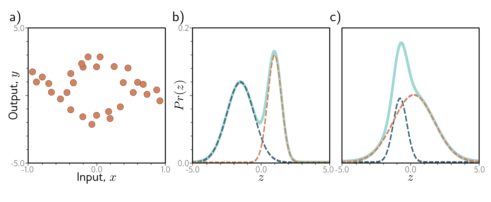

  

  <strong>Figure 5.14</strong> Multimodal data and mixture of Gaussians density. a) Example training data where, for intermediate values of the input x, the corresponding output y follows one of two paths. For example, at x = 0, the output y might be roughly -2 or +3 but is unlikely to be between these values. b) The mixture of Gaussians is a probability model suited to this kind of data. As the name suggests, the model is a weighted sum (solid cyan curve) of two or more normal distributions with different means and variances (here, two normal distributions, dashed blue and orange curves). When the means are far apart, this forms a multimodal distribution. c) When the means are close, the mixture can model unimodal but non-normal densities

where $\mu $ is a measure of the mean direction and $\kappa $ is a measure of concentration (i.e., the inverse of the variance). The term Bessel $_{0}[\kappa]$ is a modified Bessel function of the first kind of order 0. Use the recipe from section 5.2 to develop a loss function for learning the parameter $\mu $ of a model f[x, $\phi $] to predict the most likely wind direction. Your solution should treat the concentration $\kappa $ as constant. How would you perform inference?

Problem 5.4 $^{*}$ Sometimes, the outputs y for input x are multimodal (figure 5.14a); there is more than one valid prediction for a given input. Here, we might use a weighted sum of normal components as the distribution over the output. This is known as a mixture of Gaussians model. For example, a mixture of two Gaussians has parameters $\theta = \lbrace \lambda, \mu_{1}, \sigma_{1}^{2}, \mu_{2}, \sigma_{2}^{2} \rbrace $:

$$
\begin{aligned}
\Pr\left(y\mid\lambda,\mu_1,\mu_2,\sigma_1^2,\sigma_2^2\right)
&= \frac{\lambda}{\sqrt{2\pi\sigma_1^2}}\exp\left[-\frac{(y-\mu_1)^2}{2\sigma_1^2}\right]
+\frac{1-\lambda}{\sqrt{2\pi\sigma_2^2}}\exp\left[-\frac{(y-\mu_2)^2}{2\sigma_2^2}\right]
\end{aligned} \qquad (5.35)
$$

where $\lambda \in [0,1]$ controls the relative weight of the two components, which have means $\mu_{1}, \mu_{2}$ and variances $\sigma_{1}^{2}, \sigma_{2}^{2}$, respectively. This model can represent a distribution with two peaks (figure 5.14b) or a distribution with one peak but a more complex shape (figure 5.14c). Use the recipe from section 5.2 to construct a loss function for training a model f[x, $\phi $] that takes input $ x $, has parameters $\phi $, and predicts a mixture of two Gaussians. The loss should be based on $ I $ training data pairs $\lbrace x_{i}, y_{i} \rbrace $. What problems do you foresee when performing inference?

Problem 5.5 Consider extending the model from problem 5.3 to predict the wind direction using a mixture of two von Mises distributions. Write an expression for the likelihood $\Pr(y\,|\,\theta)$ for this model. How many outputs will the network need to produce?
