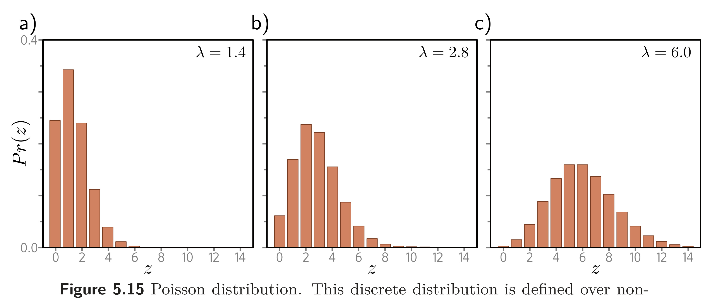

  

  <strong>Figure 5.15</strong> Poisson distribution. This discrete distribution is defined over nonnegative integers $z \in \lbrace 0, 1, 2,\ldots \rbrace$. It has a single parameter $\lambda \in \mathbb{R}^{+}$, which is known as the rate and is the mean of the distribution. a-c) Poisson distributions with rates of 1.4, 2.8, and 6.0, respectively.

Problem 5.6 Consider building a model to predict the number of pedestrians $ y \in \lbrace 0,1,2,\ldots \rbrace $ that will pass a given point in the city in the next minute, based on data x that contains information about the time of day, the longitude and latitude, and the type of neighborhood. A suitable distribution for modeling counts is the Poisson distribution (figure 5.15). This has a single parameter $\lambda > 0 $ called the rate that represents the mean of the distribution. The distribution has probability density function:

$$
\begin{aligned}
\Pr\left(y=k\right) &= \frac{\lambda^k e^{-\lambda}}{k!}
\end{aligned} \qquad (5.36)
$$

Design a loss function for this model assuming we have access to $ I $ training pairs $\lbrace x_{i}, y_{i} \rbrace $.

Problem 5.7 Consider a multivariate regression problem where we predict ten outputs, so $ y \in R^{10}$, and model each with an independent normal distribution where the means $\mu_{d}$ are predicted by the network, and variances $\sigma^{2}$ are constant. Write an expression for the likelihood $\Pr(\mathbf{y}\,|\,\mathbf{f}[\mathbf{x},\boldsymbol{\phi}])$. Show that minimizing the negative log-likelihood of this model is still equivalent to minimizing a sum of squared terms if we don't estimate the variance $\sigma^{2}$.

Problem 5.8 $^{*}$ Construct a loss function for making multivariate predictions $ y \in R^{D_{o}}$ based on independent normal distributions with different variances $\sigma_{d}^{2}$ for each dimension. Assume a heteroscedastic model so that both the means $\mu_{d}$ and variances $\sigma_{d}^{2}$ vary as a function of the data.

Problem 5.9* Construct a loss function for making multivariate predictions $ y \in R^{D_{o}}$ based on independent normal distributions with different variances $\sigma_{d}^{2}$ for each dimension. Assume a heteroscedastic model so that both the means $\mu_{d}$ and variances $\sigma_{d}^{2}$ vary as a function of the data.

Problem 5.10 Extend the model from problem 5.3 to predict both the wind direction and the wind speed and define the associated loss function.
