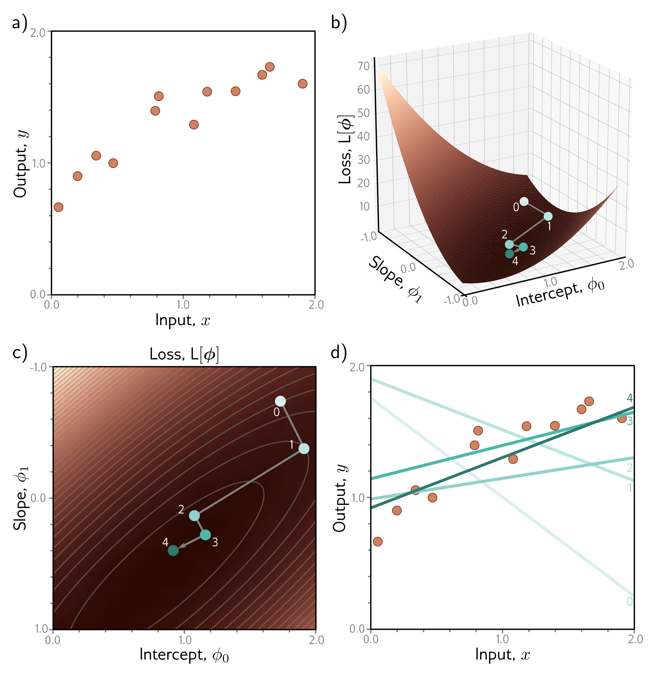

  

  <strong>Figure 6.1</strong> Gradient descent for the linear regression model. a) Training set of I = 12 input/output pairs {xi, yi}. b) Loss function showing iterations of gradient descent. We start at point 0 and move in the steepest downhill direction until we can improve no further to arrive at point 1. We then repeat this procedure. We measure the gradient at point 1 and move downhill to point 2 and so on. c) This can be visualized better as a heatmap, where the brightness represents the loss. After only four iterations, we are already close to the minimum. d) The model with the parameters at point 0 (lightest line) describes the data very badly, but each successive iteration improves the fit. The model with the parameters at point 4 (darkest line) is already a reasonable description of the training data

