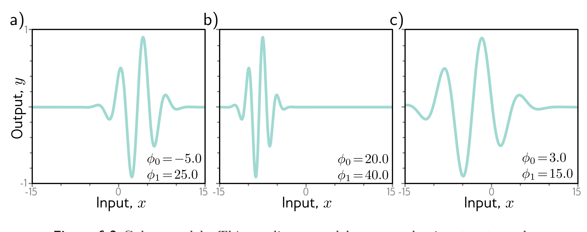
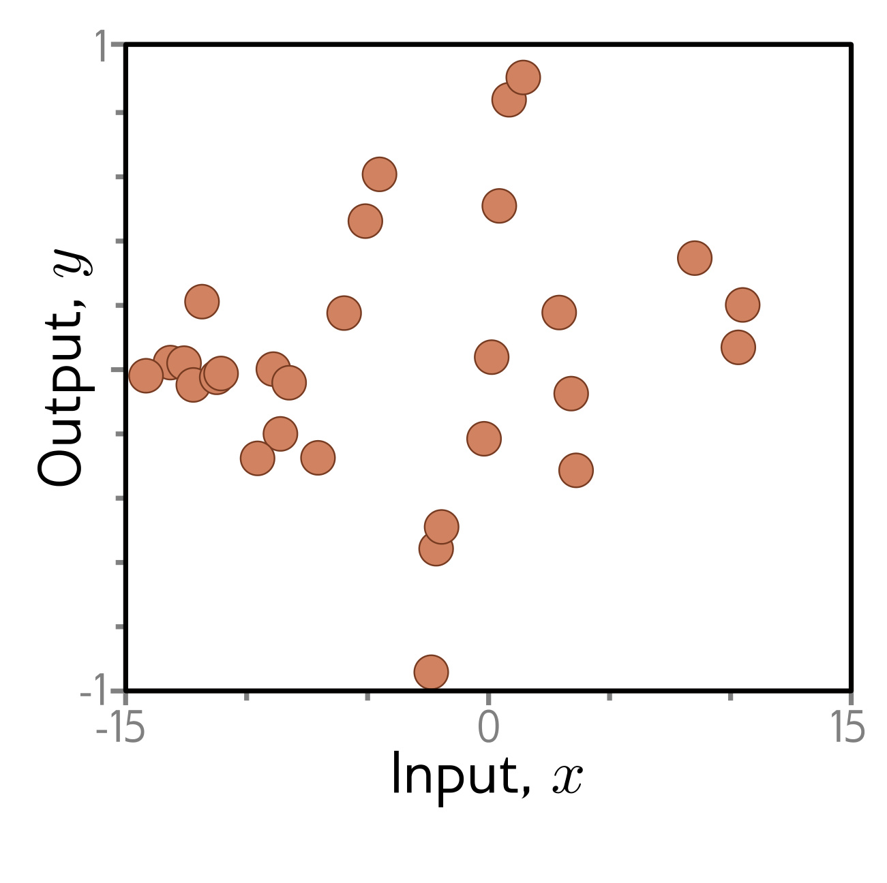

  

  <strong>Figure 6.2</strong> Gabor model. This nonlinear model maps scalar input $x$ to scalar output $y$ and has parameters $\phi = [\phi\_0, \phi\_1]^T$. It describes a sinusoidal function that decreases in amplitude with distance from its center. Parameter $\phi\_0 \in \mathbb{R}$ determines the position of the center. As $\phi\_0$ increases, the function moves left. Parameter $\phi\_1 \in \mathbb{R}^{+}$ squeezes the function along the x-axis relative to the center. As $\phi\_1$ increases, the function narrows. a-c) Model with different parameters.

  

  <strong>Figure 6.3</strong> Training data for fitting the Gabor model. The training dataset contains 28 input/output examples $\lbrace x\_i, y\_i \rbrace$. These data were created by uniformly sampling $x\_i \in [-15, 15]$, passing the samples through a Gabor model with parameters $\phi = [0.0, 16.6]^T$, and adding normally distributed noise.

## 6.1.3 Local minima and saddle points

Figure 6.4 depicts the loss function associated with the Gabor model for this dataset. There are numerous local minima (cyan circles). Here the gradient is zero, and the loss increases if we move in any direction, but we are not at the overall minimum of the function. The point with the lowest loss is known as the global minimum and is depicted by the gray circle.

If we start in a random position and use gradient descent to go downhill, there is no guarantee that we will wind up at the global minimum and find the best parameters (figure 6.5a). It's equally or even more likely that the algorithm will terminate in one of the local minima. Furthermore, there is no way of knowing whether there is a better solution elsewhere.
