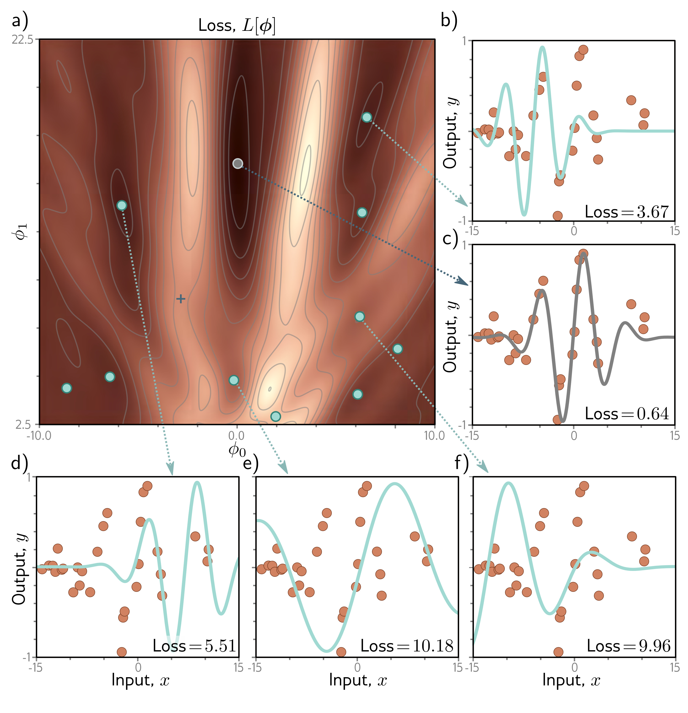

  

  <strong>Figure 6.4</strong> Loss function for the Gabor model. a) The loss function is non-convex, with multiple local minima (cyan circles) in addition to the global minimum (gray circle). It also contains saddle points where the gradient is locally zero, but the function increases in one direction and decreases in the other. The blue cross is an example of a saddle point; the function decreases as we move vertically. b–f) Models associated with the different minima. In each case, there is no small change that decreases the loss. Panel (c) shows the global minimum, which has a loss of 0.64. (Interactive figure)

