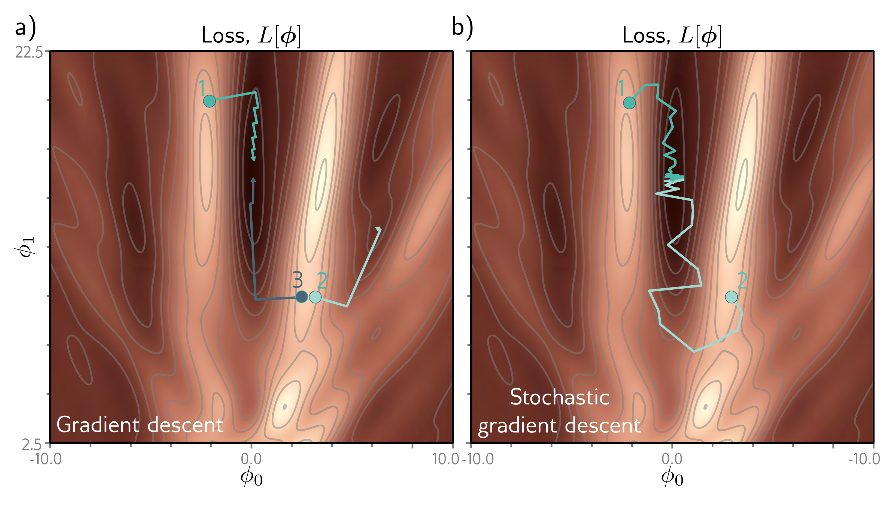

  

  <strong>Figure 6.5</strong> Gradient descent vs. stochastic gradient descent. a) Gradient descent with line search. As long as the gradient descent algorithm is initialized in this valley (e.g., point 2), it will descend toward one of the local minima. b) Stochastic gradient descent does not move to the optimization process, so it is possible to escape from the wrong valley (e.g., point 2) and still reach the global minimum.

In addition, the loss function contains saddle points (e.g., the blue cross in figure 6.4). Here, the gradient is zero, but the function increases in some directions and decreases in others. If the current parameters are not exactly at the saddle point, then gradient descent can escape by moving downhill. However, the surface near the saddle point is flat, so it’s hard to be sure that training hasn’t converged; if we terminate the algorithm when the gradient is small, we may erroneously stop near a saddle point.

## 6.2 Stochastic gradient descent

The Gabor model has two parameters, so we could find the global minimum by either (i) exhaustively searching the parameter space or (ii) repeatedly starting gradient descent from different positions and choosing the result with the lowest loss. However, neural network models can have millions of parameters, so neither approach is practical. In short, using gradient descent to find the global optimum of a high-dimensional loss function is challenging. We can find a minimum, but there is no way to tell whether this
