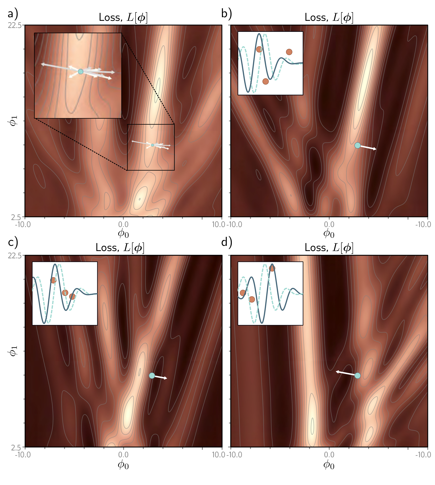

  

  <strong>Figure 6.6</strong> Alternative view of SGD for the Gabor model with a batch size three. a) Loss function for the entire training dataset. At each iteration, there is a probability distribution of possible parameter changes (inset shows samples). These correspond to different choices of the three batch elements. b) Loss function for one possible batch. The SGD algorithm moves in the downhill direction on this function for a distance that is determined by the learning rate and the local gradient magnitude. The current model (dashed function in inset) changes to better fit the batch data (solid function). c) A different batch creates a different loss function and results in a different update. d) For this batch, the algorithm moves downhill with respect to the batch loss function but in the locally uphill direction with respect to the global loss function in panel (a). This is how SGD can escape local minima

a) Loss function for the entire training dataset. At each iteration, there is a probability distribution of possible parameter changes (inset shows samples). These correspond to different choices of the three batch elements. b) Loss function for one possible batch. The SGD algorithm moves in the downhill direction on this function for a distance that is determined by the learning rate and the local gradient magnitude. The current model (dashed function in inset) changes to better fit the batch data (solid function). c) A different batch creates a different loss function and results in a different update. d) For this batch, the algorithm moves downhill with respect to the batch loss function but in the locally uphill direction with respect to the global loss function in panel (a). This is how SGD can escape local minima.
