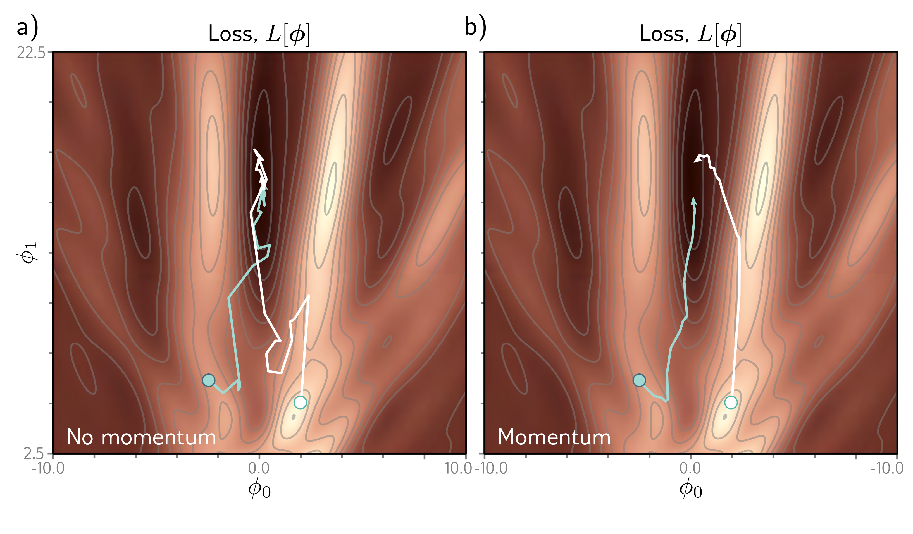
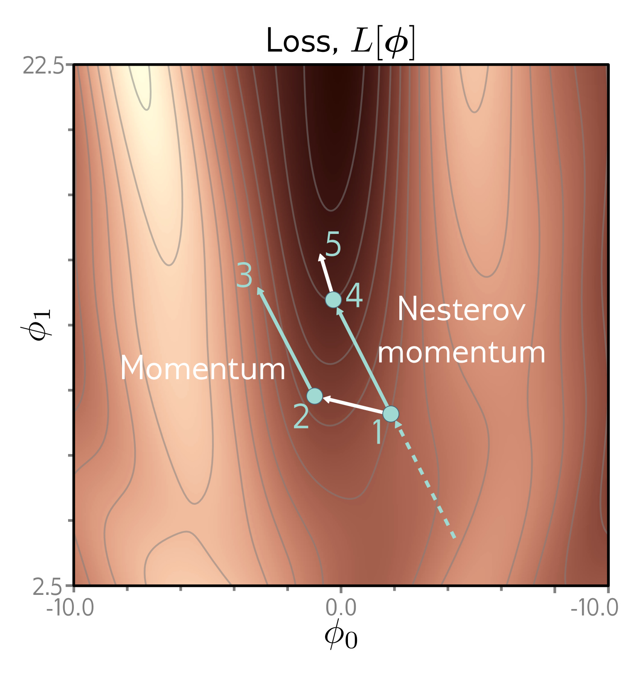

  

  <strong>Figure 6.7</strong> Stochastic gradient descent with momentum. a) Regular descent takes a very indirect path toward the minimum. b) With a momentum term, the change at the current step is a weighted combination of the previous changes and the gradient computed from the batch. This smooths out the trajectory and increases the speed of convergence.

  

  <strong>Figure 6.8</strong> Nesterov accelerated momentum. The solution has traveled along the dashed line to arrive at point 1. A traditional momentum update measures the gradient at point 1, moves some distance in this direction to point 2, and then adds the momentum term from the previous iteration (i.e., in the same direction as the dashed line), arriving at point 3. The Nesterov momentum update first applies the momentum term (moving from point 1 to point 4) and then measures the gradient and applies an update to arrive at point 5.

