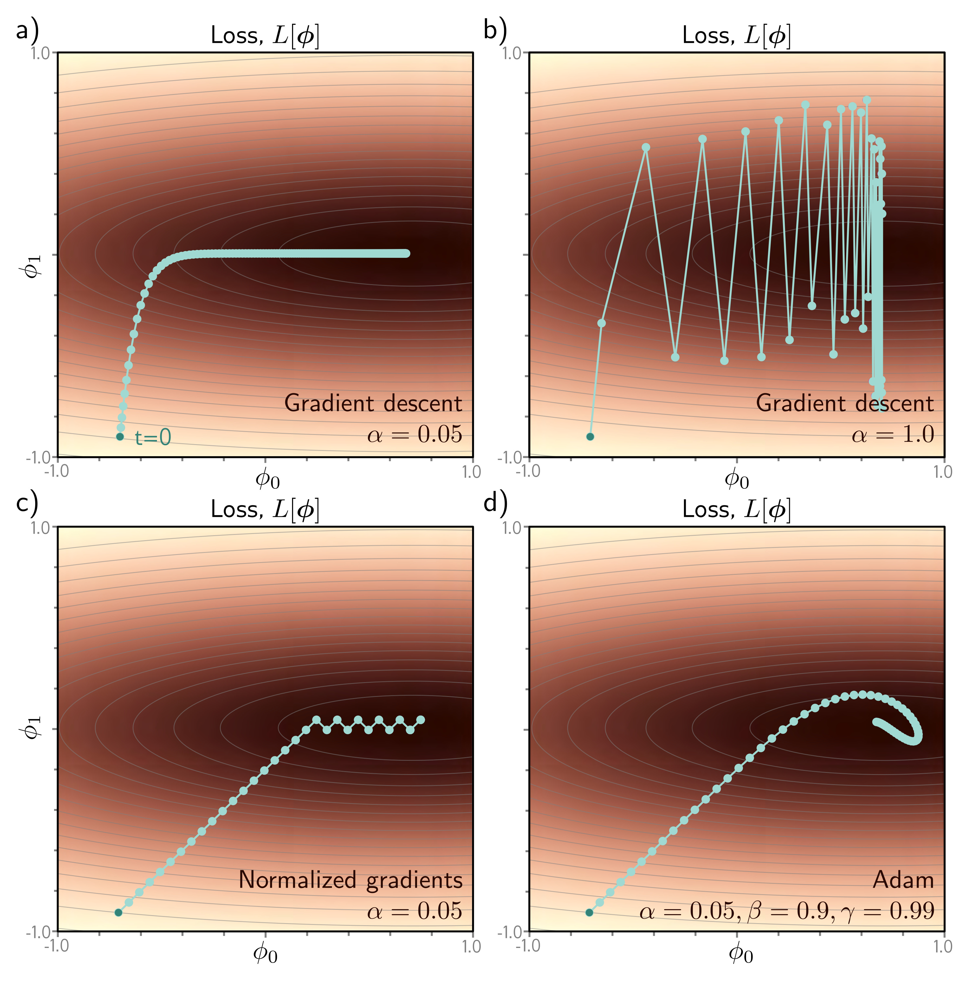

  

  <strong>Figure 6.9</strong> Adaptive moment estimation (Adam). a) This loss function changes quickly in the vertical direction but slowly in the horizontal direction. If we run full-batch gradient descent with a learning rate that makes good progress in the vertical direction, then the algorithm takes a long time to reach the final horizontal position. b) If the learning rate is chosen so that the algorithm makes good progress in the horizontal direction, it overshoots in the vertical direction and becomes unstable. c) A straightforward approach is to move a fixed distance along each axis at each step so that we move downhill in both directions. This is accomplished by normalizing the gradient magnitude and retaining only the sign. However, this does not usually converge to the exact minimum but instead oscillates back and forth around it (here between the last two points). d) The Adam algorithm uses momentum in both the estimated gradient and the normalization term, which creates a smoother path.

