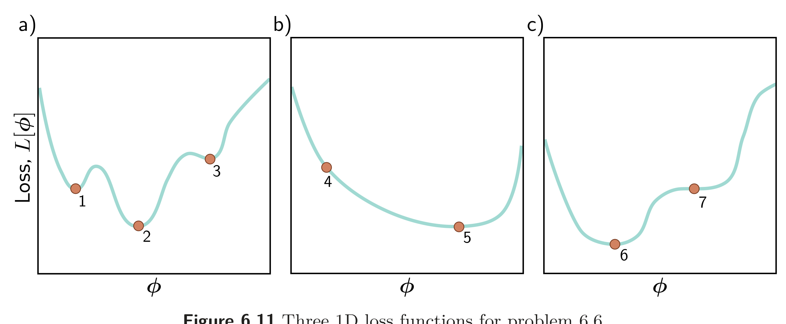

  

  <strong>Figure 6.11</strong> Three 1D loss functions for problem 6.6.

(i) Plot $y$ against $x$ for this model for different values of $\phi_{0}$ and $\phi_{1}$ and explain the qualitative meaning of each parameter. (ii) What is a suitable loss function for this model? (iii) Compute the derivatives of this loss function with respect to the parameters. (iv) Generate ten data points from a normal distribution with mean -1 and standard deviation 1 and assign them the label $y = 0$. Generate another ten data points from a normal distribution with mean 1 and standard deviation 1 and assign these the label $y = 1$. Plot the loss as a heatmap in terms of the two parameters $\phi_{0}$ and $\phi_{1}$. (v) Is this loss function convex? How could you prove this?

Problem 6.5 $^{*}$ Compute the derivatives of the least squares loss with respect to the ten parameters of the simple neural network model introduced in equation 3.1:

$$
\begin{aligned}
\mathrm{f}[x,\phi]&=\phi_{0}+\phi_{1}\mathrm{a}[\theta_{10}+\theta_{11}x]+\phi_{2}\mathrm{a}[\theta_{20}+\theta_{21}x]+\phi_{3}\mathrm{a}[\theta_{30}+\theta_{31}x].
\end{aligned} \qquad (6.23)
$$

Think carefully about what the derivative of the ReLU function $ a[\bullet]$ will be.

Problem 6.6 Which of the functions in figure 6.11 is convex? Justify your answer. Characterize each of the points 1-7 as (i) a local minimum, (ii) the global minimum, or (iii) neither.

Problem 6.7 $^{*}$ The gradient descent trajectory for path 1 in figure 6.5a oscillates back and forth inefficiently as it moves down the valley toward the minimum. It's also notable that it turns at right angles to the previous direction at each step. Provide a qualitative explanation for these phenomena. Propose a solution that might help prevent this behavior.

Problem 6.8 $^{*}$ Can (non-stochastic) gradient descent with a fixed learning rate escape local minima?

Problem 6.9 We run the stochastic gradient descent algorithm for 1,000 iterations on a dataset of size 100 with a batch size of 20. For how many epochs did we train the model?

Problem 6.10 Show that the momentum term $ m_{t}$ (equation 6.11) is an infinite weighted sum of the gradients at the previous iterations and derive an expression for the coefficients (weights) of that sum.

Problem 6.11 What dimensions will the Hessian have if the model has one million parameters?
