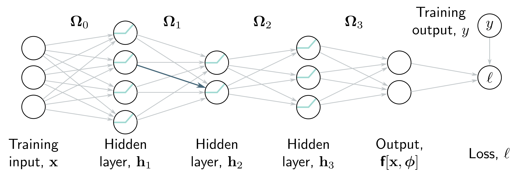

  

  <strong>Figure 7.1</strong> Backpropagation forward pass. The goal is to compute the derivatives of the loss $\ell$ with respect to each of the weights (arrows) and biases (not shown). In other words, we want to know how a small change to each parameter will affect the loss. Each weight multiplies the hidden unit at its source and contributes the result to the hidden unit at its destination. Consequently, the effects of any small change to the weight will be scaled by the activation of the source hidden unit. For example, the blue weight is applied to the second hidden unit at layer 1; if the activation of this unit doubles, then the effect of a small change to the blue weight will double too. Hence, to compute the derivatives of the weights, we need to calculate and store the activations at the hidden layers. This is known as the forward pass since it involves running the network equations sequentially.

unit. This, in turn, changes the values of the hidden units in the subsequent layer, which will change the hidden units in the layer after that, and so on, until a change is made to the model output and, finally, the loss.

Hence, to know how changing a parameter modifies the loss, we also need to know how changes to every subsequent hidden layer will, in turn, modify their successor. These same quantities are required when considering other parameters in the same or earlier layers. It follows that we can calculate them once and reuse them. For example, consider computing the effect of a small change in weights that feed into hidden layers  $h_{3}$ ,  $h_{2}$ , and  $h_{1}$ , respectively:

- To calculate how a small change in a weight or bias feeding into hidden layer  $h_{3}$  modifies the loss, we need to know (i) how a change in layer  $h_{2}$  affects  $h_{3}$ , (ii) how  $h_{3}$  changes the model output f, and (iii) how this output changes the loss  $\ell$  (figure 7.2a).

- To calculate how a small change in a weight or bias feeding into hidden layer  $h_{1}$  modifies the loss, we need to know (i) how a change in layer  $h_{1}$  affects layer  $h_{2}$ , (ii) how a change in layer  $h_{2}$  affects layer  $h_{3}$ , (iii) how a change in the model output f, and (iv) how the model output changes the loss  $\ell$  (figure 7.2c).

- To calculate how a small change in a weight or bias feeding into hidden layer  $h_{1}$  modifies the loss, we need to know (i) how a change in layer  $h_{2}$  affects layer  $h_{3}$ , (ii) how a change in layer  $h_{2}$  affects layer  $h_{3}$ , (iii) how a change in the model output f, and (iv) how the model output changes the loss (figure 7.2c).
