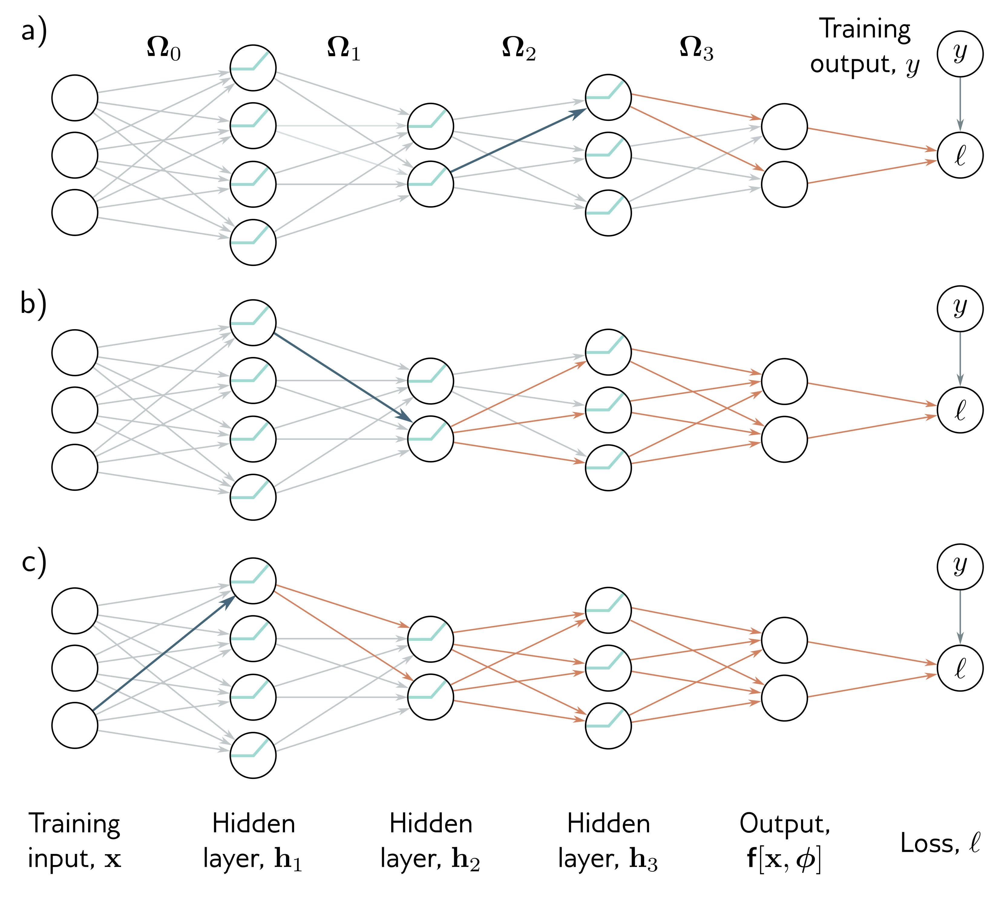

  

  <strong>Figure 7.2</strong> Backpropagation backward pass. a) To compute how a change to a weight feeding into layer $h\_{3}$ (blue arrow) changes the loss, we need to know how $h\_{1}$ changes $h\_{2}$ and how these changes propagate through to the loss (orange arrows). The backward pass first computes derivatives at the end of the network and then works backward to exploit the inherent redundancy of these computations.

