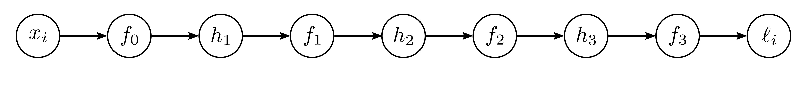

  

  <strong>Figure 7.3</strong> Backpropagation forward pass. We compute and store each of the intermediate variables in turn until we finally calculate the loss.

we calculate the derivatives of each parameter, starting at the end of the network, and reusing previous calculations as we move toward the start.

Forward pass: We treat the computation of the loss as a series of calculations:

$$
\begin{aligned}
\begin{array}{rcl}f_{0}&=&\beta_{0}+\omega_{0}\cdot x_{i}\\h_{1}&=&sin[f_{0}]\\f_{1}&=&\beta_{1}+\omega_{1}\cdot h_{1}\\h_{2}&=&exp[f_{1}]\\f_{2}&=&\beta_{2}+\omega_{2}\cdot h_{2}\\h_{3}&=&cos[f_{2}]\\f_{3}&=&\beta_{3}+\omega_{3}\cdot h_{3}\\l_{i}&=&(f_{3}-y_{i})^{2}.\end{array}
\end{aligned}
\tag{7.9}
$$

We compute and store the values of the intermediate variables $f_{k}$ and $h_{k}$ (figure 7.3).

Backward pass #1: We now compute the derivatives of $\ell_{i}$ with respect to these intermediate variables, but in reverse order:

$$
\begin{aligned}
\frac{\partial\ell_{i}}{\partial f_{3}},\quad\frac{\partial\ell_{i}}{\partial h_{3}},\quad\frac{\partial\ell_{i}}{\partial f_{2}},\quad\frac{\partial\ell_{i}}{\partial h_{2}},\quad\frac{\partial\ell_{i}}{\partial f_{1}},\quad\frac{\partial\ell_{i}}{\partial h_{1}},\quad and\quad\frac{\partial\ell_{i}}{\partial f_{0}}.
\end{aligned}
\tag{7.10}
$$

The first of these derivatives is straightforward:

$$
\begin{aligned}
\frac{\partial\ell_{i}}{\partial h_{3}}=\frac{\partial f_{3}}{\partial h_{3}}\frac{\partial\ell_{i}}{\partial f_{3}}.
\end{aligned}
\tag{7.11}
$$

The next derivative can be calculated using the chain rule:

$$
\begin{aligned}
\frac{\partial\ell_{i}}{\partial h_{3}}=2(f_{3}-y_{i}).
\end{aligned}
\tag{7.12}
$$

The left-hand side asks how $\ell_{i}$ changes when $h_{3}$ changes. The right-hand side says we can decompose this into (i) how $f_{3}$ changes when $h_{3}$ changes and (ii) how $\ell_{i}$ changes when $f_{3}$ changes. In the original equations, $h_{3}$ changes $f_{3}$, which changes $\ell_{i}$, and the derivatives
