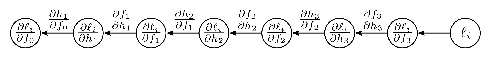

  

  <strong>Figure 7.4</strong> Backpropagation backward pass #1. We work backward from the end of the function computing the derivatives $\partial\ell_{i}/\partial f_{k}$ and $\partial\ell_{i}/\partial h_{k}$ of the loss with respect to the intermediate quantities. Each derivative is computed from the previous one by multiplying by terms of the form $\partial f_{k}/\partial h_{k}$ or $\partial h_{k}/\partial f_{k-1}$.

represent the effects of this chain. Notice that we already computed the second of these derivatives, and the other is the derivative of  $\beta_{3} + \omega_{3} \cdot h_{3}$  with respect to  $h_{3}$, which is  $\omega_{3}$.

We continue in this way, computing the derivatives of the output with respect to these intermediate quantities (figure 7.4):

$$
\frac{\partial f_{k}}{\partial\beta_{k}}=1\qquad \mathrm{and}\qquad\frac{\partial f_{k}}{\partial\omega_{k}}=h_{k}.
\qquad (7.15)
$$
