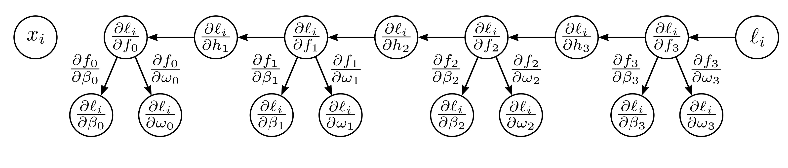

  

  <strong>Figure 7.5</strong> Backpropagation backward pass #2. Finally, we compute the derivatives $\partial l_{i}/\partial\beta_{k}$ and $\partial l_{i}/\partial\omega_{k}$. Each derivative is computed by multiplying the term $\partial l_{i}/\partial f_{k}$ by $\partial f_{k}/\partial\beta_{k}$ or $\partial f_{k}/\partial\omega_{k}$ as appropriate.

This is consistent with Observation 1 from the previous section; the effect of a change in the weight $\omega_{k}$ is proportional to the value of the source variable $h_{k}$ (which was stored in the forward pass). The final derivatives from the term $f_{0} = \beta_{0} + \omega_{0} \cdot x_{i}$ are:

$$
\begin{aligned}
\frac{\partial f_{0}}{\partial\beta_{0}}=1\qquad and\quad\frac{\partial f_{0}}{\partial\omega_{0}}\quad=\quad x_{i}. \tag{7.16}
\end{aligned}
$$

Backpropagation is both simpler and more efficient than computing the derivatives individually, as in equation 7.8. $^{1}$

## 7.4 Backpropagation algorithm

Now we repeat this process for a three-layer network (figure 7.1). The intuition and much of the algebra are identical. The main differences are that intermediate variables  $f_{k}$ ,  $h_{k}$  are vectors, the biases  $\beta_{k}$  are vectors, the weights  $\Omega_{k}$  are matrices, and we are using ReLU functions rather than simple algebraic functions like  $\cos[\bullet]$ .

Forward pass: We write the network as a series of sequential calculations:

$$
\begin{aligned}
\begin{array}{rcl}\mathbf{f}_{0}&=&\beta_{0}+\Omega_{0}x_{i}\\ \mathbf{h}_{1}&=&a[\mathbf{f}_{0}]\\\mathbf{f}_{1}&=&\beta_{1}+\Omega_{1}\mathbf{h}_{1}\\ \mathbf{f}_{2}&=&a[\mathbf{f}_{0}]\\\beta_{3}&=&\beta_{1}+\Omega_{2}\mathbf{h}_{2}\\ \mathbf{f}_{3}&=&a[\mathbf{f}_{0}]\\\beta_{4}&=&\beta_{2}+\Omega_{3}\mathbf{h}_{3}\\ \ell_{i}&=&l[\mathbf{f}_{0},y_{i}],\end{array} \tag{7.17}
\end{aligned}
$$

$^{1}$ Note that we did not actually need the derivatives  $\partial l_{i}/\partial h_{k}$  of the loss with respect to the activations. In the final backpropagation algorithm, we will not compute these explicitly.

Draft: please send errata to udlbookmail@gmail.com.
