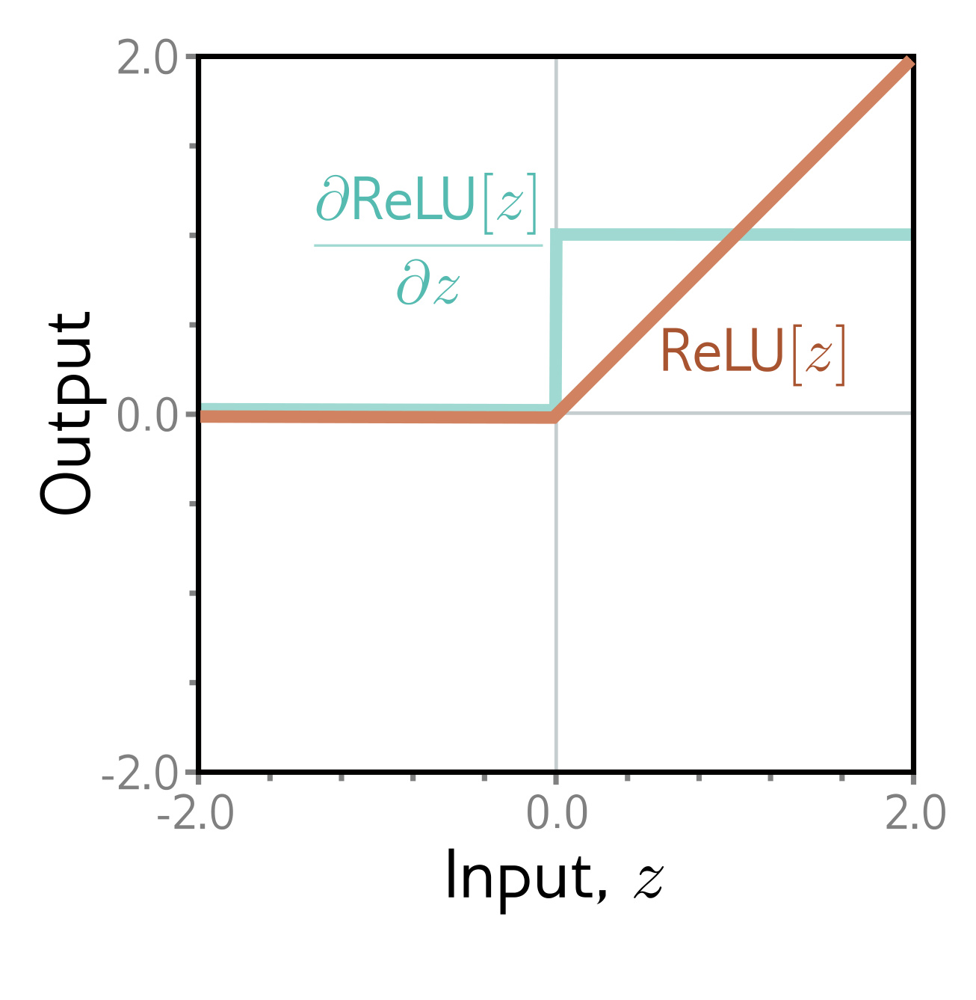

  

  <strong>Figure 7.6</strong> Derivative of rectified linear unit. The rectified linear unit (orange curve) returns zero when the input is less than zero and returns the input otherwise. Its derivative (cyan curve) returns zero when the input is less than zero (since the slope here is zero) and one when the input is greater than zero (since the slope here is one).

**Figure 1**

where $\mathbf{f}_{k-1}$ represents the pre-activations at the $k^{th}$ hidden layer (i.e., the values before the ReLU function $\mathbf{a}[\bullet]$) and $\mathbf{h}_{k}$ contains the activations at the $k^{th}$ hidden layer (i.e., after the ReLU function). The term $\lfloor\mathbf{f}_{3},y_{i}\rfloor$ represents the loss function (e.g., least squares or binary cross-entropy loss). In the forward pass, we work through these calculations and store all the intermediate quantities.
Backward pass #1: Now let’s consider how the loss changes when the pre-activations $\mathbf{f}_{0}, \mathbf{f}_{1}, \mathbf{f}_{2}$ change. Applying the chain rule, the expression for the derivative of the loss $\ell_{i}$ with respect to $\mathbf{f}_{2}$ is:

Appendix B.5 Matrix calculus

$$
\begin{aligned}
\frac{\partial\ell_{i}}{\partial\mathbf{f}_{2}}=\frac{\partial\mathbf{h}_{3}}{\partial\mathbf{f}_{2}}\overline{{\frac{\partial\mathbf{f}_{3}}{\partial\mathbf{h}_{3}}}}\frac{\partial\ell_{i}}{\partial\mathbf{f}_{3}}.
\end{aligned} \quad (7.18)
$$

The three terms on the right-hand side have sizes $D_{3} \times D_{3}, D_{3} \times D_{f}$, and $D_{f} \times 1$, respectively, where $D_{3}$ is the number of hidden units in the third layer, and $D_{f}$ is the dimensionality of the model output $\mathbf{f}_{3}$.

Similarly, we can compute how the loss changes when we change $\mathbf{f}_{1}$ and $\mathbf{f}_{0}$:

$$
\begin{aligned}
\frac{\partial\ell_{i}}{\partial\mathbf{f}_{1}}=\quad\frac{\partial\mathbf{h}_{2}}{\partial\mathbf{f}_{1}}\frac{\partial\mathbf{f}_{2}}{\partial\mathbf{h}_{2}}\left(\frac{\partial\mathbf{h}_{3}}{\partial\mathbf{f}_{2}}\frac{\partial\mathbf{f}_{3}}{\partial\mathbf{h}_{3}}\frac{\partial\ell_{i}}{\partial\mathbf{f}_{3}}\right)
\end{aligned} \quad (7.19)
$$

$$
\begin{aligned}
\frac{\partial\ell_{i}}{\partial\mathbf{f}_{0}}=\quad\frac{\partial\mathbf{h}_{1}}{\partial\mathbf{f}_{0}}\frac{\partial\mathbf{f}_{1}}{\partial\mathbf{h}_{1}}\left(\frac{\partial\mathbf{h}_{2}}{\partial\mathbf{f}_{1}}\frac{\partial\mathbf{f}_{2}}{\partial\ell_{3}}\frac{\partial\mathbf{h}_{3}}{\partial\mathbf{f}_{3}}\frac{\partial\ell_{i}}{\partial\mathbf{f}_{3}}\right).
\end{aligned} \quad (7.20)
$$

Note that in each case, the term in brackets was computed in the previous step. By working backward through the network, we can reuse the previous computations.

Moreover, the terms themselves are simple. Working backward through the right-hand side of equation 7.18, we have:

- The derivative $\partial\ell_{i}/\partial\mathbf{f}_{3}$ of the loss $\ell_{i}$ with respect to the network output $\mathbf{f}_{3}$ will depend on the loss function but usually has a simple form.

• The derivative $\partial\mathbf{f}_{3}/\partial\mathbf{h}_{3}$ of the network output with respect to hidden layer $\mathbf{h}_{3}$ is:
