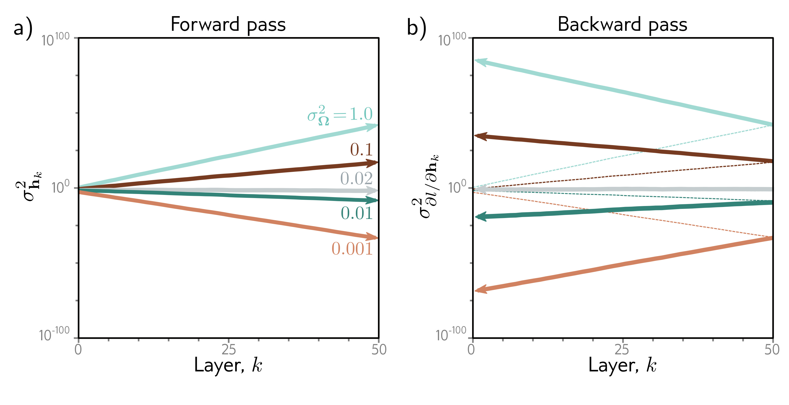

  

  <strong>Figure 7.7</strong> Weight initialization. Consider a deep network with 50 hidden layers and $D_{h}=100$ hidden units per layer. The network has a 100-dimensional input x initialized from a standard normal distribution, a single fixed target $y=0$, and a least squares loss function. The bias vectors $\beta_{k}$ are initialized to zero, and the weight matrices $\Omega_{k}$ are initialized with a normal distribution with mean zero and five different variances $\sigma_{\Omega}^{2}\in\lbrace 0.001, 0.01, 0.02, 0.1, 1.0\rbrace$. a) Variance of hidden unit activations ( $\sigma_{\Omega}^{2}=2/D_{h}=0.02$ ), the variance is stable. However, for larger values, it increases rapidly, and for smaller values, it decreases rapidly (note log scale). b) The variance of the gradients in the backward pass (solid lines) continues this trend; if we initialize with a value larger than 0.02, the magnitude of the gradients increases rapidly as we pass back through the network. If we initialize with a value smaller, then the magnitude decreases. These are known as the exploding gradient and vanishing gradient problems, respectively.

This, in turn, implies that if we want the variance $\sigma_{f}^{2}$, of the subsequent pre-activations $f'$ to be the same as the variance $\sigma_{f}^{2}$ of the original pre-activations $f$ during the forward pass, we should set:

$$
\begin{aligned}
\sigma_{\Omega}^{2}=\frac{2}{D_{h}},
\end{aligned} \quad (7.32)
$$

where $D_{h}$ is the dimension of the original layer to which the weights were applied. This is known as He initialization.

## 7.5.2 Initialization for backward pass

A similar argument establishes how the variance of the gradients $\partial l/\partial f_{k}$ changes during the backward pass. During the backward pass, we multiply by the transpose $\mathbf{\Omega}^{T}$ of the weight matrix (equation 7.25), so the equivalent expression becomes:
