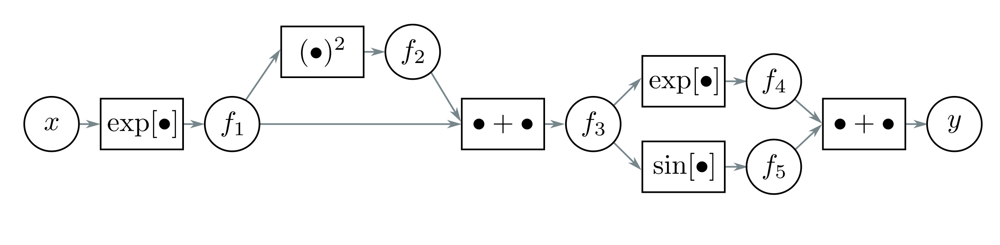

  

  <strong>Figure 7.9</strong> Computational graph for problem 7.12 and problem 7.13. Adapted from Domke (2010).

and

$$
\begin{aligned}
\mathrm{rect}[z]=\begin{cases}0&z<0\\1&0\leq z\leq1\\0&z>1\end{cases}. \tag{7.41}
\end{aligned}
$$

Discuss why these functions are problematic for neural network training with gradient-based optimization methods.

Problem 7.9 $^{*}$  Consider a loss function  $\ell[f]$ , where  $f = \beta + \Omega h$ . We want to find how the loss  $\ell$  changes when we change  $\Omega$ , which we'll express with a matrix that contains the derivative  $\partial\ell/\partial\Omega_{ij}$  at the  $i^{th}$  row and  $j^{th}$  column. Find an expression for  $\partial f_{i}/\partial\Omega_{ij}$  and, using the chain rule, show that:

$$
\begin{aligned}
\frac{\partial\ell}{\partial\Omega}=\frac{\partial\ell}{\partial\mathbf{f}}\mathbf{h}^{T}. \tag{7.42}
\end{aligned}
$$

Problem 7.10 $^{*}$  Derive the equations for the backward pass of the backpropagation algorithm for a network that uses leaky ReLU activations, which are defined as:

$$
\begin{aligned}
\mathbf{a}[z]=\mathrm{ReLU}[z]=\begin{cases}\alpha\cdot z&z<0\\z&z\geq0\end{cases}, \tag{7.43}
\end{aligned}
$$

where $\alpha$ is a small positive constant (typically $0.1$).

Problem 7.11 $^{*}$  Consider training a network with fifty layers using gradient checkpointing. Assume that we store the pre-activations at every tenth hidden layer during the forward pass. Explain how to compute the derivatives in this situation.

Problem 7.12 $^{*}$  This problem explores computing derivatives on general acyclic computational graphs. Consider the function:

$$
\begin{aligned}
y=\exp\left[\exp[x]+\exp[x]^{2}\right]+\sin[\exp[x]+\exp[x]^{2}]. \tag{7.44}
\end{aligned}
$$

We can break this down into a series of intermediate computations so that:
