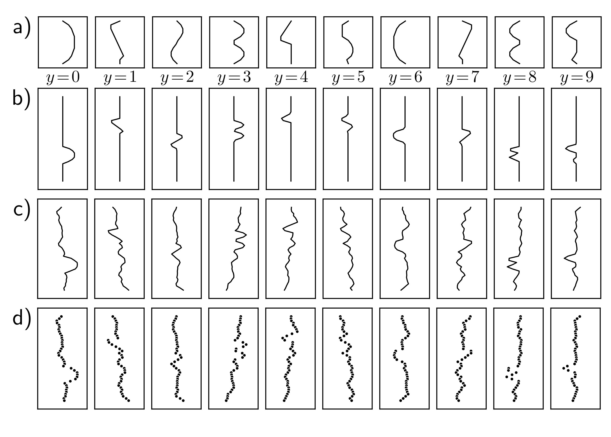
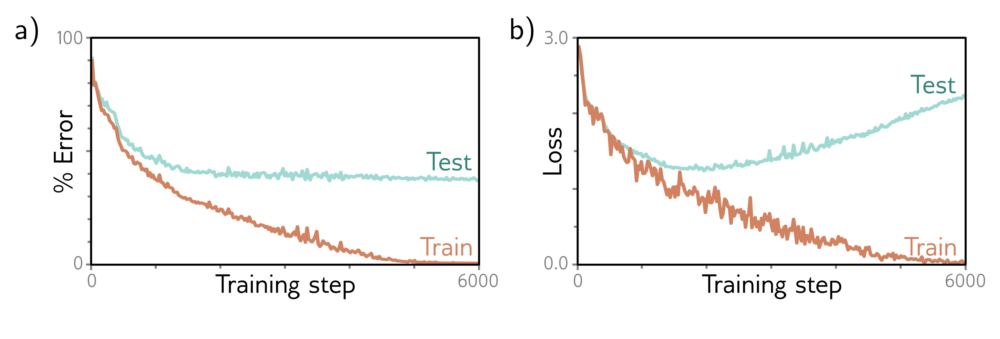

  

  <strong>Figure 8.1</strong> MNIST-1D. a) Templates for 10 classes $y \in \lbrace 0, \ldots, 9 \rbrace$, based on digits 0-9. b) Training examples $x$ are created by randomly transforming a template and c) adding noise. d) The horizontal offset of the transformed template is then sampled at 40 vertical positions. Adapted from (Greydanus, 2020)

b)

  

  <strong>Figure 8.2</strong> MNIST-1D results. a) Percent classification error as a function of the training step. The training set errors decrease to zero, but the test errors do not drop below $\sim$ 40%. This model doesn't generalize well to new test data. b) Loss as a function of the training step. The training loss decreases steadily toward zero. The test loss decreases at first but subsequently increases as the model becomes increasingly confident about its (wrong) predictions.

