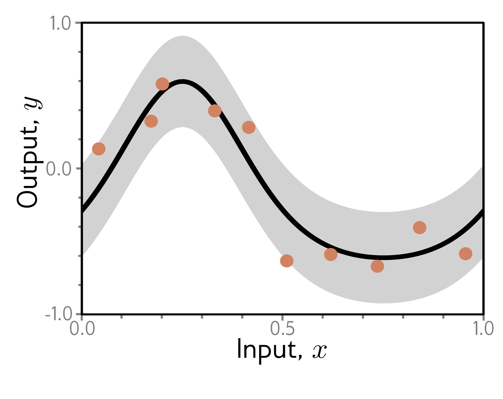

  

  <strong>Figure 8.3</strong> Regression function. Solid black line shows ground truth function. To generate I training examples $\lbrace x\_{i}, y\_{i} \rbrace$, the input space $x \in [0,1]$ is divided into I equal segments and one sample $x\_{i}$ is drawn from a uniform distribution within each segment. The corresponding value $y\_{i}$ is created by evaluating the function at $x\_{i}$ and adding Gaussian noise (gray region shows $\pm2$ standard deviations). The test data are generated in the same way.

orized the training set but be unable to predict new examples. To estimate the true performance, we need a separate test set of input/output pairs  $\lbrace x\_{i}, y\_{i} \rbrace$. To this end, we generate 1000 more examples using the same process. Figure 8.2a also shows the errors for this test data as a function of the training step. These decrease as training proceeds, but only to around 40%. This is better than the chance error rate of 90% but far worse than for the training set; the model has not generalized well to the test data.
The test loss (figure 8.2b) decreases for the first 1500 training steps but then increases again. At this point, the test error rate is fairly constant; the model makes the same mistakes but with increasing confidence. This decreases the probability of the correct answers and thus increases the negative log-likelihood. This increasing confidence is a side-effect of the softmax function; the pre-softmax activations are driven to increasingly extreme values to make the probability of the training data approach one (see figure 5.10).

We now consider the sources of the errors that occur when a model fails to generalize. To make this easier to visualize, we revert to a 1D least squares regression problem where we know exactly how the ground truth data were generated. Figure 8.3 shows a quasi-sinusoidal function; both training and test data are generated by sampling input values in the range  $[0,1]$, passing them through this function, and adding Gaussian noise with a fixed variance.

We fit a simplified shallow neural net to this data (figure 8.4). The weights and biases that connect the input layer to the hidden layer are chosen so that the "joints" of the function are evenly spaced across the interval. If there are D hidden units, then these joints will be at  $0, 1/D, 2/D, \ldots, (D-1)/D$. This model can represent any piecewise linear function with D equally sized regions in the range  $[0,1]$. As well as being easy to understand, this model also has the advantage that it can be fit in closed form without the need for stochastic optimization algorithms (see problem 8.3). Consequently, we can guarantee to find the global minimum of the loss function during training.

## 8.2 Sources of error
