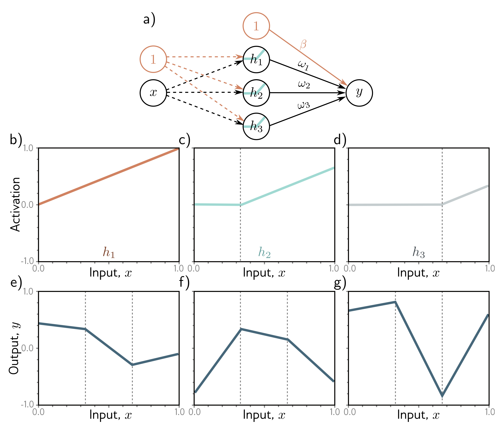

b)

c)

d)

e)

f)

g)

  

  <strong>Figure 8.4</strong> Simplified neural network with three hidden units. a) The weights and biases between the input and hidden layer are fixed (dashed arrows). b-d) They are chosen so that the hidden unit activations have slope one, and their joints are equally spaced across the interval, with joints at x = 0, x = 1/3, and x = 2/3, respectively. Modifying the remaining parameters $\phi = \lbrace \beta, \omega\_1, \omega\_2, \omega\_3 \rbrace$ can create any piecewise linear function over $x \in [0, 1]$ with joints at 1/3 and 2/3. e-g) Three example functions with different values of the parameters $\phi$.

