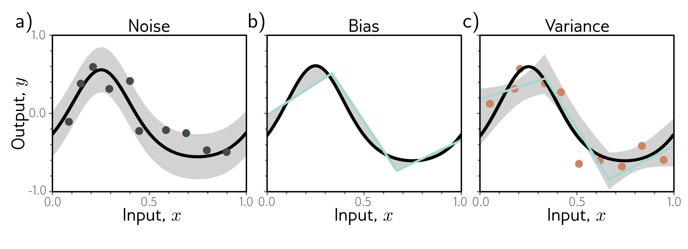

  

  <strong>Figure 8.5</strong> Sources of test error. a) Noise. Data generation is noisy, so even if the model exactly replicates the true underlying function (black line), the noise in the test data (gray points) means that some error will remain (gray region represents two standard deviations). b) Bias. Even with the best possible parameters, the three-region model (cyan line) cannot exactly fit the true function (black line). This bias is another source of error (gray regions represent signed error). c) Variance. In practice, we have limited noisy training data (orange points). When we fit the model, we don't recover the best possible function from panel (b) but a slightly different function (cyan line) that reflects idiosyncrasies of the training data. This provides an additional source of error (gray region represents two standard deviations). Figure 8.6 shows how this region was calculated.

## 8.2.1 Noise, bias, and variance

There are three possible sources of error, which are known as noise, bias, and variance respectively (figure 8.5):

Noise The data generation process includes the addition of noise, so there are multiple possible valid outputs y for each input x (figure 8.5a). This source of error is insurmountable for the test data. Note that it does not necessarily limit the training performance; we will likely never see the same input x twice during training, so it is still possible to fit the training data perfectly.

Noise may arise because there is a genuine stochastic element to the data generation process, because some of the data are mislabeled, or because there are further explanatory variables that were not observed. In rare cases, noise may be absent; for example, a network might approximate a function that is deterministic but requires significant computation to evaluate. However, noise is usually a fundamental limitation on the fit the training data perfectly.

Bias A second potential source of error may occur because the model is not flexible enough to fit the true function perfectly. For example, the three-region neural network model cannot exactly describe the quasi-sinusoidal function, even when the parameters are chosen optimally (figure 8.5b). This is known as bias.
