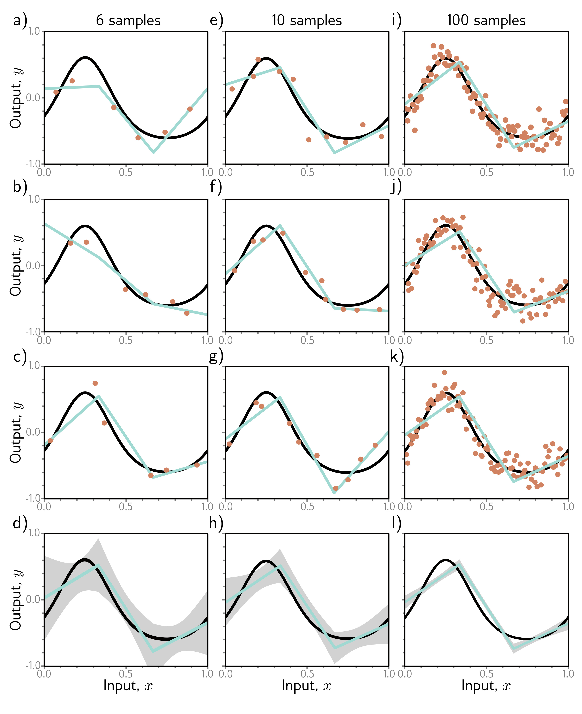

  

  <strong>Figure 8.6</strong> Reducing variance by increasing training data. a-c) The three-region model fitted to three different randomly sampled datasets of six points. The fitted model is quite different each time. d) We repeat this experiment many times and plot the mean model predictions (cyan line) and the variance of the model predictions (gray area shows two standard deviations). e-h) We do the same experiment, but this time with datasets of size ten. The variance of the predictions is reduced. i-l) We repeat this experiment with datasets of size 100. Now the fitted model is always similar, and the variance is small.

