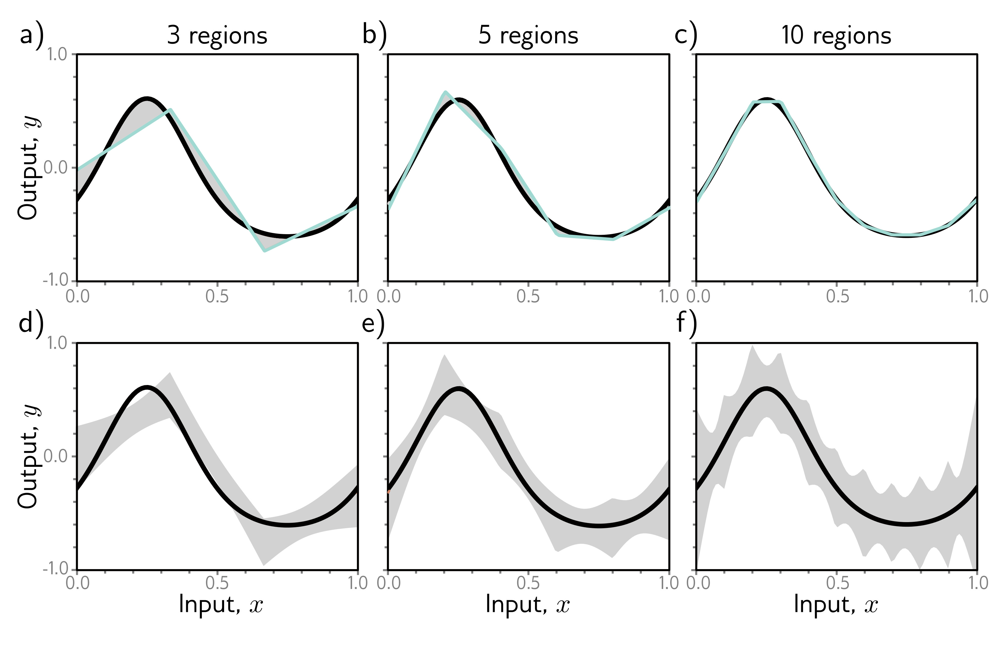

  

  <strong>Figure 8.7</strong> Bias and variance as a function of model capacity. a–c) As we increase the number of hidden units of the toy model, the number of linear regions increases, and the model becomes able to fit the true function closely; the bias (gray region) decreases. d–f) Unfortunately, increasing the model capacity has the side-effect of increasing the variance term (gray region). This is known as the bias-variance trade-off.

## 8.4 Double descent

In the previous section, we examined the bias-variance trade-off as we increased the capacity of a model. Let's now return to the MNIST-1D dataset and see whether this happens in practice. We use 10,000 training examples, test with another 5,000 examples and examine the training and test performance as we increase the capacity (number of parameters) in the model. We train the model with Adam and a step size of 0.005 using a full batch of 10,000 examples for 4000 steps.

Figure 8.10a shows the training and test error for a neural network with two hidden layers as the number of hidden units increases. The training error decreases as the capacity grows and quickly becomes close to zero. The vertical dashed line represents the capacity where the model has the same number of parameters as there are training examples, but the model memorizes the dataset before this point. The test error decreases as we add model capacity but does not increase as predicted by the bias-variance trade-off curve; it keeps decreasing.

In figure 8.10b, we repeat this experiment, but this time, we randomize 15% of the
