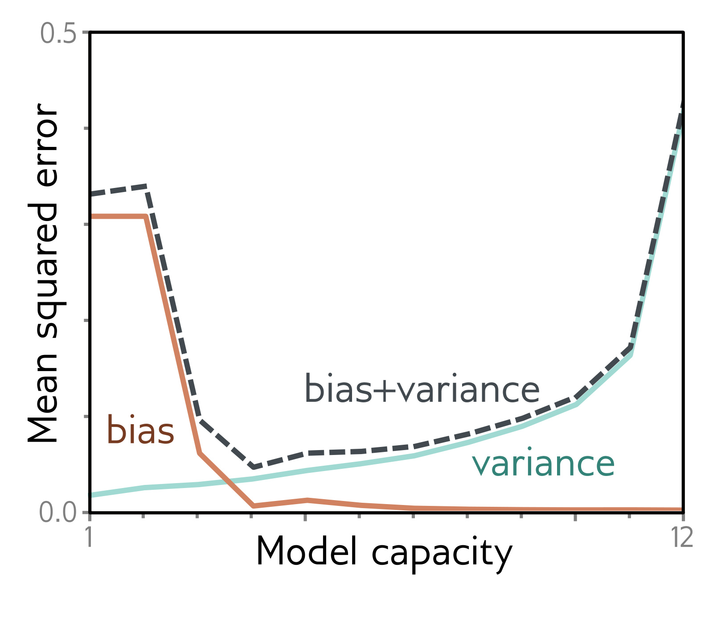
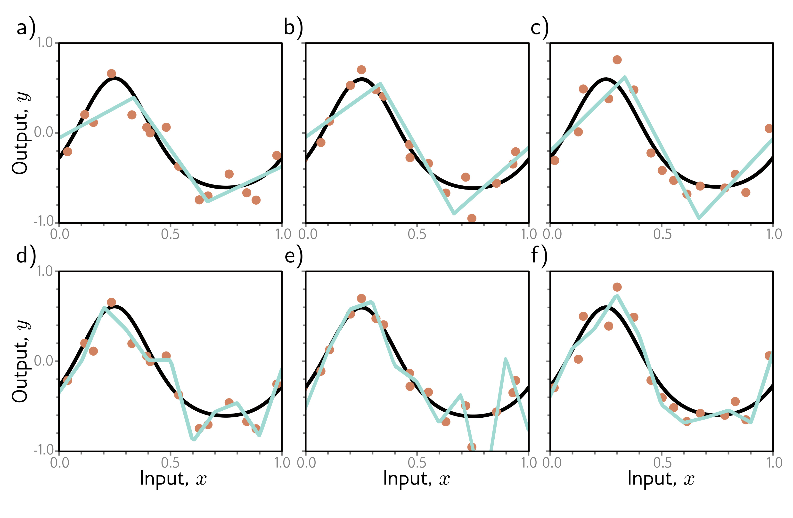

  

  <strong>Figure 8.8</strong> Overfitting. a–c) A model with three regions is fit to three different datasets of fifteen points each. The result is similar in all three cases (i.e., the variance is low). d–f) A model with ten regions is fit to the same datasets. The additional flexibility does not necessarily produce better predictions. While these three models each describe the training data better, they are not necessarily closer to the true underlying function (black curve). Instead, they overfit the data and describe the noise, and the variance (difference between fitted curves) is larger.

  

  <strong>Figure 8.9</strong> Bias-variance trade-off. The bias and variance terms from equation 8.7 are plotted as a function of the model capacity (number of hidden units / linear regions in range of data) in the simplified model using training data from figure 8.8. As the capacity increases, the bias (solid orange line) decreases, but the variance (solid cyan line) increases. The sum of these two terms (dashed gray line) is minimized when the capacity is four.

