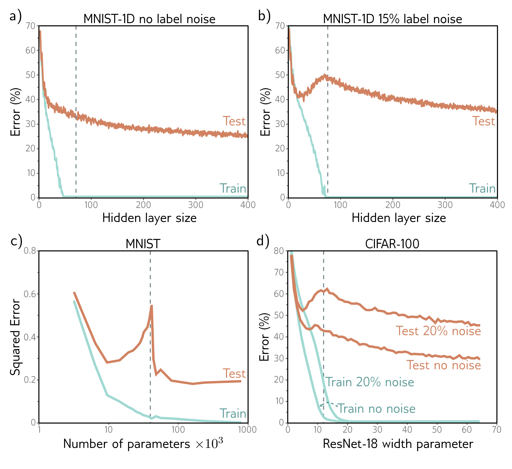

b)

c)

d)

  

  <strong>Figure 8.10</strong> Double descent. a) Training and test error on MNIST-1D for a two-hidden layer network as we increase the number of hidden units (and hence parameters) in each layer. The training error decreases to zero as the number of parameters approaches the number of training examples (vertical dashed line). The test error does not show the expected bias-variance trade-off but continues to decrease even after the model has memorized the dataset. b) The same experiment is repeated with noisier training data. Again, the training error reduces to zero, although it now takes almost as many parameters as training points to memorize the dataset. The test error shows the predicted bias/variance trade-off; it decreases as the capacity increases but then increases again as we near the point where the training data is exactly memorized. However, it subsequently decreases again and ultimately reaches a better performance level. This is known as double descent. Depending on the loss function, the model, and the amount of noise in the data, the double descent pattern can be seen to a greater or lesser degree across many datasets. c) Results on MNIST (without label noise) with shallow neural network from Belkin et al. (2019). d) Results on CIFAR-100 with ResNet18 network (see chapter 11) from Nakkiran et al. (2021). See original papers for details.

