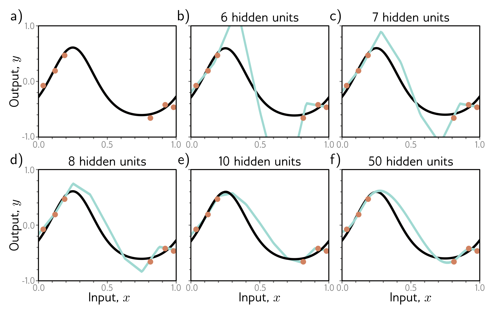

  

  <strong>Figure 8.11</strong> Increasing capacity (hidden units) allows smoother interpolation between sparse data points. a) Consider this situation where the training data (orange circles) are sparse; there is a large region in the center with no data examples to constrain the model to mimic the true function (black curve). b) If we fit a model with just enough capacity to fit the training data (cyan curve), then it has to contort itself to pass through the training data, and the output predictions will not be smooth. c–f) However, as we add more hidden units, the model has the ability to interpolate between the points more smoothly (smoothest possible curve plotted in each case). However, unlike in this figure, it is not obliged to.

This argument is plausible. It’s certainly true that as we add more capacity to the model, it will have the capability to create smoother functions. Figures 8.11b–f show the smoothest possible functions that still pass through the data points as we increase the number of hidden units. When the number of parameters is very close to the number of training data examples (figure 8.11b), the model is forced to contort itself to fit the training data exactly, resulting in erratic predictions. This explains why the peak in the double descent curve is so pronounced. As we add more hidden units, the model has the ability to construct smoother functions that are likely to generalize better to new data.

However, this does not explain why over-parameterized models should produce smooth functions. Figure 8.12 shows three functions that can be created by the simplified model with 50 hidden units. In each case, the model fits the data exactly, so the loss is zero. If the modern regime of double descent is explained by increasing smoothness, then what exactly is encouraging this smoothness?
