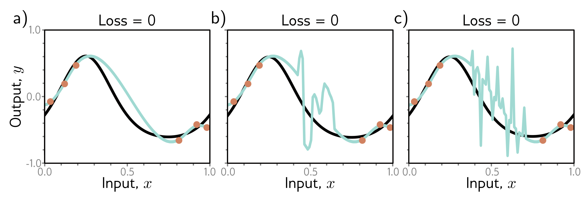

b)

c)

  

  <strong>Figure 8.12</strong> Regularization. a-c) Each of the three fitted curves passes through the data points exactly, so the training loss for each is zero. However, we might expect the smooth curve in panel (a) to generalize much better to new data than the erratic curves in panels (b) and (c). Any factor that biases a model toward a subset of the solutions with a similar training loss is known as a regularizer. It is thought that the initialization and/or fitting of neural networks have an implicit regularizing effect. Consequently, in the over-parameterized regime, more reasonable solutions, such as that in panel (a), are encouraged.

The answer to this question is uncertain, but there are two likely possibilities. First, the network initialization may encourage smoothness, and the model never departs from the sub-domain of smooth function during the training process. Second, the training algorithm may somehow "prefer" to converge to smooth functions. Any factor that biases a solution toward a subset of equivalent solutions is known as a regularizer, so one possibility is that the training algorithm acts as an implicit regularizer (see section 9.2).

## 8.5 Choosing hyperparameters

In the previous section, we discussed how test performance changes with model capacity. Unfortunately, in the classical regime, we don't have access to either the bias (which requires knowledge of the true underlying function) or the variance (which requires multiple independently sampled datasets to estimate). In the modern regime, there is no way to tell how much capacity should be added before the test error stops improving. This raises the question of exactly how we should choose model capacity in practice.

For a deep network, the model capacity depends on the number of hidden layers and hidden units per layer as well as other aspects of architecture that we have yet to introduce. Furthermore, the choice of learning algorithm and any associated parameters (learning rate, etc.) also affects the test performance. These elements are collectively termed hyperparameters. The process of finding the best hyperparameters is termed hyperparameter search or (when focused on network structure) neural architecture search.
