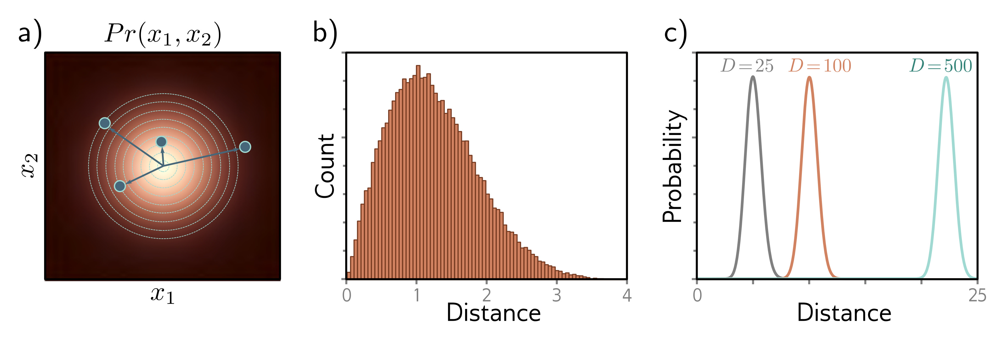

  

  <strong>Figure 8.13</strong> Typical sets. a) Standard normal distribution in two dimensions. Circles are four samples from this distribution. As the distance from the center increases, the probability decreases, but the volume of space at that radius (i.e., the area between adjacent evenly spaced circles) increases. b) These factors trade off so that the histogram of distances of samples from the center has a pronounced peak. c) In higher dimensions, this effect becomes more extreme, and the probability of observing a sample close to the mean becomes vanishingly small. Although the most likely point is at the mean of the distribution, the typical samples are found in a relatively narrow shell.

$$
\begin{aligned}
\mathrm{Vol}[r]=\frac{r^{D}\pi^{D/2}}{\Gamma[D/2+1]},
\end{aligned}
\tag{8.8}
$$

where $\Gamma[\bullet]$ is the Gamma function. Show using Stirling’s formula that the volume of a hypersphere of diameter one (radius $r=0.5$) becomes zero as the dimension increases.

Problem 8.8 $^{*}$  Consider a hypersphere of radius r = 1. Find an expression for the proportion of the total volume that lies in the outermost 1% of the distance from the center (i.e., in the outermost shell of thickness 0.01). Show that this becomes one as the dimension increases.

Problem 8.9 Figure 8.13c shows the distribution of distances of samples of a standard normal distribution as the dimension increases. Empirically verify this finding by sampling from the standard normal distributions in 25, 100, and 500 dimensions and plotting a histogram of the distances from the center. What closed-form probability distribution describes these distances?
