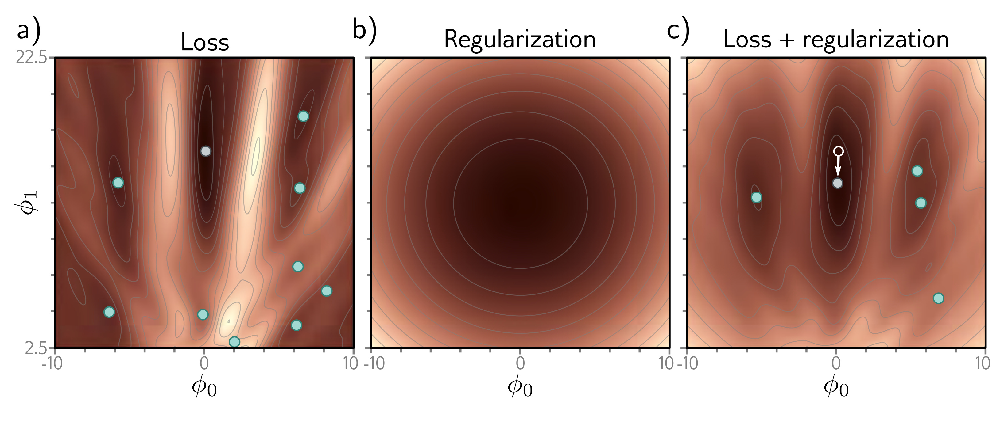

  

  <strong>Figure 9.1</strong> Explicit regularization. a) Loss function for Gabor model (see section 6.1.2). Cyan circles represent local minima. Gray circle represents the global minimum. b) The regularization term favors parameters close to the center of the plot by adding an increasing penalty as we move away from this point. c) The final loss function is the sum of the original loss function plus the regularization term. This surface has fewer local minima, and the global minimum has moved to a different position (arrow shows change).

toward certain solutions, we include an additional term:

$$
\begin{aligned}
\hat{\boldsymbol{\phi}}=\underset{\boldsymbol{\phi}}{\mathrm{argmin}}\left[\sum_{i=1}^{I}\ell_{i}[\mathbf{x}_{i},\mathbf{y}_{i}]+\lambda\cdot\mathbf{g}[\boldsymbol{\phi}]\right],
\end{aligned}
\tag{9.2}
$$

where g[ $\phi$ ] is a function that returns a scalar which takes larger values when the parameters are less preferred. The term  $\lambda$  is a positive scalar that controls the relative contribution of the original loss function and the regularization term. The minima of the regularized loss function usually differ from those in the original, so the training procedure converges to different parameter values (figure 9.1).

## 9.1.1 Probabilistic interpretation

Regularization can be viewed from a probabilistic perspective. Section 5.1 shows how about the parameters before we observe the data and we now have the maximum a posteriori or MAP criterion:

$$
\begin{aligned}
\hat{\boldsymbol{\phi}}=\underset{\boldsymbol{\phi}}{\mathrm{argmax}}\left[\prod_{i=1}^{I}Pr(\mathbf{y}_{i}|\mathbf{x}_{i},\boldsymbol{\phi})\right].
\end{aligned}
\tag{9.3}
$$

The regularization term can be considered as a prior  $Pr(\phi)$  that represents knowledge about the parameters before we observe the data and we now have the maximum a posteriori or MAP criterion:
