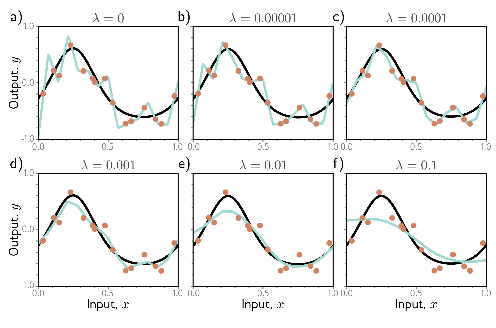

b)

c)

d)

e)

f)

  

  <strong>Figure 9.2</strong> L2 regularization in simplified network with 14 hidden units (see figure 8.4). a-f) Fitted functions as we increase the regularization coefficient $\lambda$. The black curve is the true function, the orange circles are the noisy training data, and the cyan curve is the fitted model. For small $\lambda$ (panels a-b), the fitted function passes exactly through the data points. For intermediate $\lambda$ (panels c-d), the function is smoother and more similar to the ground truth. For large $\lambda$ (panels e-f), the regularization term overpowers the likelihood term, so the fitted function is too smooth and the overall fit is worse.

## 9.2 Implicit regularization

An intriguing recent finding is that neither gradient descent nor stochastic gradient descent moves neutrally to the minimum of the loss function; each exhibits a preference for some solutions over others. This is known as implicit regularization.

## 9.2.1 Implicit regularization in gradient descent

Consider a continuous version of gradient descent where the step size is infinitesimal. The change in parameters  $\phi$  will be governed by the differential equation:

$$
\frac{d\phi}{dt}=-\frac{\partial L}{\partial\phi}. \qquad (9.6)
$$
