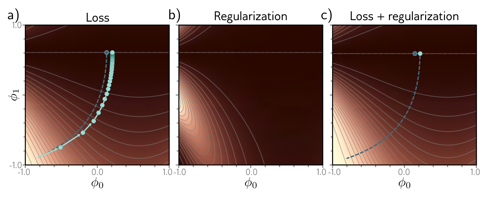

  

  <strong>Figure 9.3</strong> Implicit regularization in gradient descent. a) Loss function with family of global minima on horizontal line $\phi_{1}=0.61$ . Dashed blue line shows continuous gradient descent path starting in bottom-left. Cyan trajectory shows discrete gradient descent with step size 0.1 (first few steps shown explicitly as arrows). The finite step size causes the paths to diverge and reach a different final position. b) This disparity can be approximated by adding a regularization term to the continuous gradient descent loss function that penalizes the squared gradient magnitude. c) After adding this term, the continuous gradient descent path converges to the same place that the discrete one did on the original function.

Gradient descent approximates this process with a series of discrete steps of size  $\alpha$ :

$$
\begin{aligned}
\phi_{t+1}=\phi_{t}-\alpha\frac{\partial L[\phi_{t}]}{\partial\phi},
\end{aligned}
\tag{9.7}
$$

The discretization causes a deviation from the continuous path (figure 9.3).

This deviation can be understood by deriving a modified loss term  $\tilde{L}$  for the continuous case that arrives at the same place as the discretized version on the original loss L. It can be shown (see notes “Implicit regularization in gradient descent” at end of chapter) that this modified loss is:

$$
\begin{aligned}
\tilde{L}_{C D}[\phi]=L[\phi]+\frac{\alpha}{4}\left\|\frac{\partial L}{\partial\phi}\right\|^{2}
\end{aligned}
\tag{9.8}
$$

In other words, the discrete trajectory is repelled from places where the gradient norm is large (the surface is steep). This doesn’t change the position of the minima where the gradients are zero anyway. However, it changes the effective loss function elsewhere and modifies the optimization trajectory, which potentially converges to a different minimum. Implicit regularization due to gradient descent may be responsible for the observation that full batch gradient descent generalizes better with larger step sizes (figure 9.5a).
