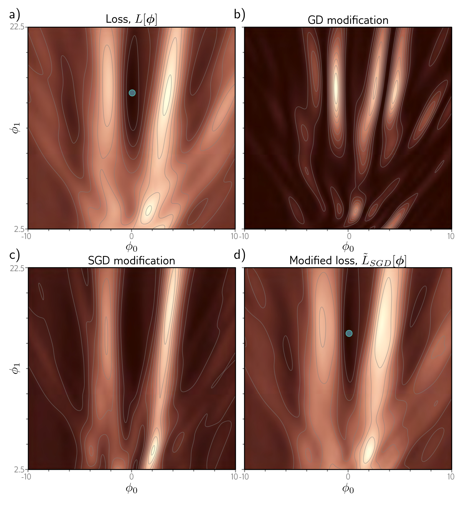

  

  <strong>Figure 9.4</strong> Implicit regularization for stochastic gradient descent. a) Original loss function for Gabor model (section 6.1.2). Blue point represents global minimum. b) Implicit regularization term from gradient descent penalizes the squared gradient magnitude. c) Additional implicit regularization from stochastic gradient descent penalizes the variance of the batch gradients. d) Modified loss function (sum of original loss plus two implicit regularization components). Blue point represents global minimum which may now be in a different place from panel (a).

