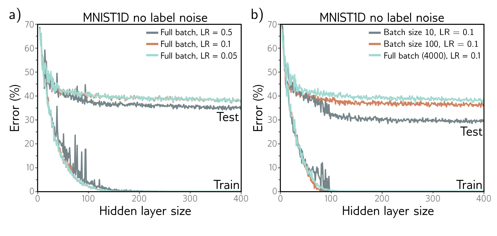

  

  <strong>Figure 9.5</strong> Effect of learning rate (LR) and batch size for 4000 training and 4000 test examples from MNIST-1D (see figure 8.1) for a neural network with two hidden layers. a) Performance is better for large learning rates than for intermediate or small ones. In each case, the number of iterations is 6000/LR, so each solution has the opportunity to move the same distance. b) Performance is superior for smaller batch sizes. In each case, the number of iterations was chosen so that the training data were memorized at roughly the same model capacity.

## 9.3.1 Early stopping

Early stopping refers to stopping the training procedure before it has fully converged. This can reduce overfitting if the model has already captured the coarse shape of the underlying function but has not yet had time to overfit to the noise (figure 9.6). One way of thinking about this is that since the weights are initialized to small values (see section 7.5), they simply don’t have time to become large, so early stopping has a similar effect to explicit L2 regularization. A different view is that early stopping reduces the effective model complexity. Hence, we move back down the bias/variance trade-off curve from the critical region, and performance improves (see figures 8.9 and 8.10).

Early stopping has a single hyperparameter, the number of steps after which learning is terminated. As usual, this is chosen empirically using a validation set (section 8.5). However, for early stopping, the hyperparameter can be selected without the need to train multiple models. The model is trained once, the performance on the validation set is monitored every T iterations, and the associated parameters are stored. The stored parameters where the validation performance was best are selected.

## 9.3.2 Ensembling

Another approach to reducing the generalization gap between training and test data is to build several models and average their predictions. A group of such models is known
