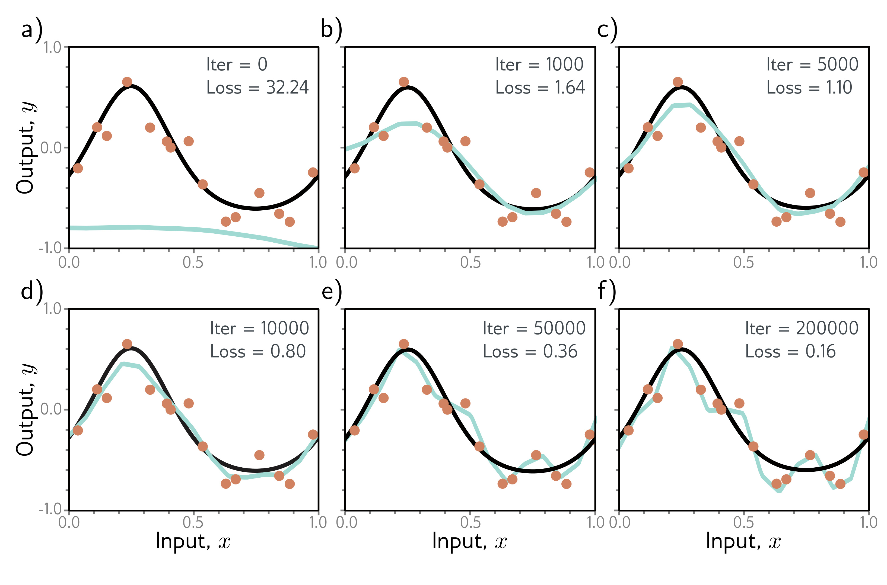

  

  <strong>Figure 9.6</strong> Early stopping. a) Simplified shallow network model with 14 linear regions (figure 8.4) is initialized randomly (cyan curve) and trained with SGD using a batch size of five and a learning rate of 0.05. b–d) As training proceeds, the function first captures the coarse structure of the true function (black curve) before e–f) overfitting to the noisy training data (orange points). Although the training loss continues to decrease throughout this process, the learned models in panels (c) and (d) are closest to the true underlying function. They will generalize better on average to test data than those in panels (e) or (f).

as an ensemble. This technique reliably improves test performance at the cost of training and storing multiple models and performing inference multiple times.

The models can be combined by taking the mean of the outputs (for regression problems) or the mean of the pre-softmax activations (for classification problems). The assumption is that model errors are independent and will cancel out. Alternatively, we can take the median of the outputs (for regression problems) or the most frequent predicted class (for classification problems) to make the predictions more robust.

One way to train different models is just to use different random initializations. This may help in regions of input space far from the training data. Here, the fitted function is relatively unconstrained, and different models may produce different predictions, so the average of several models may generalize better than any single model.

A second approach is to generate several different datasets by re-sampling the training data with replacement and training a different model from each. This is known as bootstrap aggregating or bagging for short (figure 9.7). It has the effect of smoothing out the data; if a data point is not present in one training set, the model will interpo-
