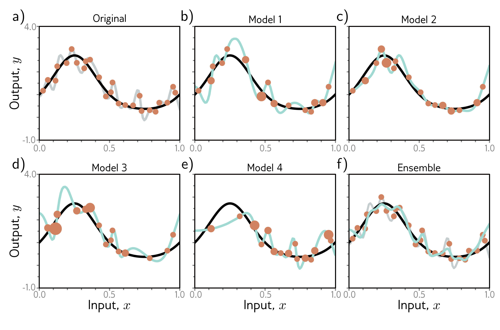

  

  <strong>Figure 9.7</strong> Ensemble methods. a) Fitting a single model (gray curve) to the entire dataset (orange points). b–e) Four models created by re-sampling the data with replacement (bagging) four times (size of orange point indicates number of times the data point was re-sampled). f) When we average the predictions of this ensemble, the result (cyan curve) is smoother than the result from panel (a) for the full dataset (gray curve) and will probably generalize better.

late from nearby points; hence, if that point was an outlier, the fitted function will be more moderate in this region. Other approaches include training models with different hyperparameters or training completely different families of models.

## 9.3.3 Dropout

Dropout clamps a random subset (typically 50%) of hidden units to zero at each iteration of SGD (figure 9.8). This makes the network less dependent on any given hidden unit and encourages the weights to have smaller magnitudes so that the change in the function due to the presence or absence of any specific hidden unit is reduced.

This technique has the positive benefit that it can eliminate undesirable “kinks” in the function that are far from the training data and don’t affect the loss. For example, consider three hidden units that become active sequentially as we move along the curve (figure 9.9a). The first hidden unit causes a large increase in the slope. A second hidden
