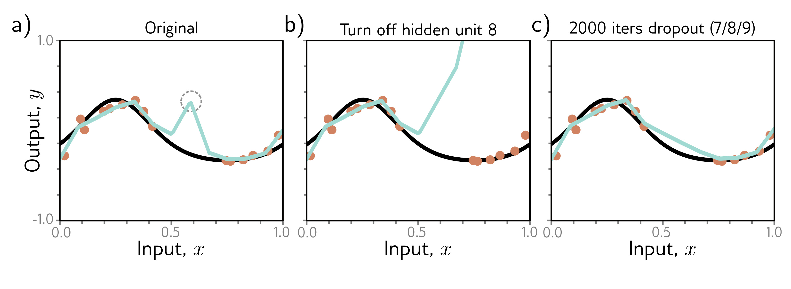

  

  <strong>Figure 9.9</strong> Dropout mechanism. a) An undesirable kink in the curve is caused by a sequential increase in the slope, decrease in the slope (at circled joint), and then another increase to return the curve to its original trajectory. Here we are using full-batch gradient descent, and the model (from figure 8.4) fits the data as well as possible, so further training won't remove the kink. b) Consider what happens if we remove the eighth hidden unit that produced the circled joint in panel (a), as might happen using dropout. Without the decrease in the slope, the right-hand side of the function takes an upwards trajectory, and a subsequent gradient descent step will aim to compensate for this change. c) Curve after 2000 iterations of (i) randomly removing one of the three hidden units that cause the kink and (ii) performing a gradient descent step. The kink does not affect the loss but is nonetheless removed by this approximation of the dropout mechanism.

## 9.3.4 Applying noise

Dropout can be interpreted as applying multiplicative Bernoulli noise to the network activations. This leads to the idea of applying noise to other parts of the network during training to make the final model more robust.

One option is to add noise to the input data; this smooths out the learned function (figure 9.10). For regression problems, it can be shown to be equivalent to adding a regularizing term that penalizes the derivatives of the network's output with respect to its input. An extreme variant is adversarial training, in which the optimization algorithm actively searches for small perturbations of the input that cause large changes to the output. These can be thought of as worst-case additive noise vectors.

A second possibility is to add noise to the weights. This encourages the network to make sensible predictions even for small perturbations of the weights. The result is that training converges to local minima in the middle of wide, flat regions, where changing the individual weights does not matter much.

Finally, we can perturb the labels. The maximum-likelihood criterion for multiclass classification aims to predict the correct class with absolute certainty (equation 5.24). To this end, the final network activations (i.e., before the softmax function) are pushed to very large values for the correct class and very small values for the wrong classes.

We could discourage this overconfident behavior by assuming that a proportion $\rho$ of
