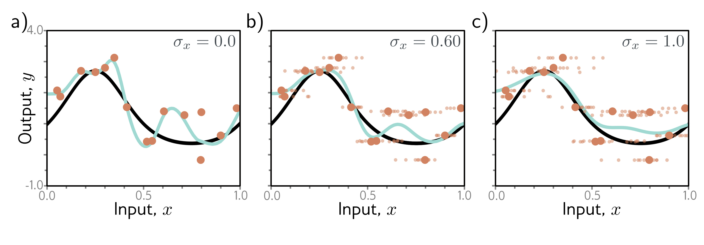

  

  <strong>Figure 9.10</strong> Adding noise to inputs. At each step of SGD, random noise with variance $\sigma_{x}^{2}$ is added to the batch data. a–c) Fitted model with different noise levels (small dots represent ten samples). Adding more noise smooths out the fitted function (cyan line).

the training labels are incorrect and belong with equal probability to the other classes. This could be done by randomly changing the labels at each training iteration. However, the same end can be achieved by changing the loss function to minimize the cross-entropy between the predicted distribution and a distribution where the true label has probability  $1 - \rho$ , and the other classes have equal probability. This is known as label smoothing and improves generalization in diverse scenarios.

## 9.3.5 Bayesian inference

The maximum likelihood approach is generally overconfident; it selects the most likely parameters during training and uses these to make predictions. However, many parameter values may be broadly compatible with the data and only slightly less likely. The Bayesian approach treats the parameters as unknown variables and computes a distribution  $Pr(\phi|\lbrace \mathbf{x}_{i},\mathbf{y}_{i}\rbrace)$  over these parameters  $\phi$  conditioned on the training data  $\lbrace x_{i},y_{i}\rbrace$  using Bayes' rule:

$$
\begin{aligned}
Pr(\phi|\{\mathbf{x}_{i},\mathbf{y}_{i}\})=\frac{\prod_{i=1}^{I}Pr(\mathbf{y}_{i}|\mathbf{x}_{i},\phi)Pr(\phi)}{\int\prod_{i=1}^{I}Pr(\mathbf{y}_{i}|\mathbf{x}_{i},\phi)Pr(\phi)d\phi}, \tag{9.11}
\end{aligned}
$$

where  $Pr(\phi|\lbrace \mathbf{x}_{i},\mathbf{y}_{i}\rbrace)$  over these parameters  $\phi$  conditioned on the training data  $\lbrace x_{i},y_{i}\rbrace$  using Bayes' rule:

using Bayes' rule:

where  $Pr(\phi|\lbrace \mathbf{x}_{i},\mathbf{y}_{i}\rbrace)$  over these parameters  $\phi$  conditioned on the training data  $\lbrace x_{i},y_{i}\rbrace$

The prediction y for new input x is an infinite weighted sum (i.e., an integral) of the

$$
\begin{aligned}
Pr(\mathbf{y}|\mathbf{x},\{\mathbf{x}_{i},\mathbf{y}_{i}\})=\int Pr(\mathbf{y}|\mathbf{x},\phi)Pr(\phi|\{\mathbf{x}_{i},\mathbf{y}_{i}\})d\phi. \tag{9.12}
\end{aligned}
$$

This is effectively an infinite weighted ensemble, where the weight depends on (i) the prior probability of the parameters and (ii) their agreement with the data.
