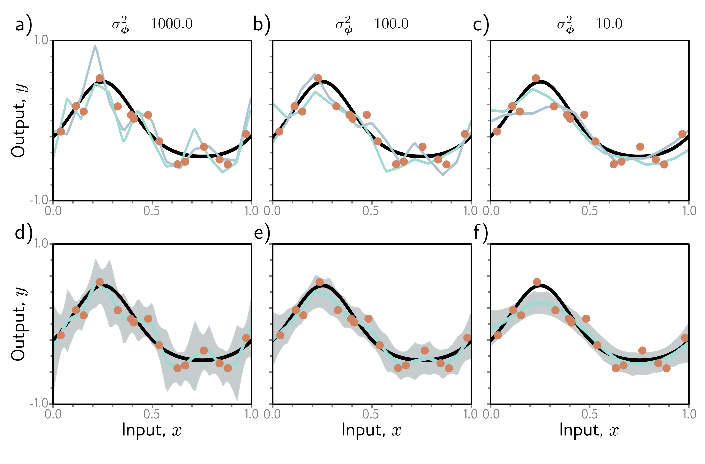

b)

c)

d)

e)

f)

  

  <strong>Figure 9.11</strong> Bayesian approach for simplified network model (see figure 8.4). The parameters are treated as uncertain. The posterior probabilitye \mathbf{x}_{i},\mathbf{y}_{i} \rbrace)$ for a set of parameters is determined by their compatibility with the data $\lbrace \mathbf{x}_{i},\mathbf{y}_{i} \rbrace$ and a prior distribution $\Pr(\phi)$. a-c) Two sets of parameters (cyan and gray curves) sampled from the posterior using normally distributed priors with mean zero and three variances. When the prior variance $\sigma_{\phi}^{2}$ is small, the parameters also tend to be small, and the functions smoother. d-f) Inference proceeds by taking a weighted sum over all possible parameter values where the weights are the posterior probabilities. This produces both a prediction of the mean (cyan curves) and the associated uncertainty (gray region is two standard deviations).

The Bayesian approach is elegant and can provide more robust predictions than those that derive from maximum likelihood. Unfortunately, for complex models like neural networks, there is no practical way to represent the full probability distribution over the parameters or to integrate over it during the inference phase. Consequently, all current methods of this type make approximations of some kind, and typically these add considerable complexity to learning and inference.

## 9.3.6 Transfer learning and multi-task learning

When training data are limited, other datasets can be exploited to improve performance. In transfer learning (figure 9.12a), the network is pre-trained to perform a related sec-
