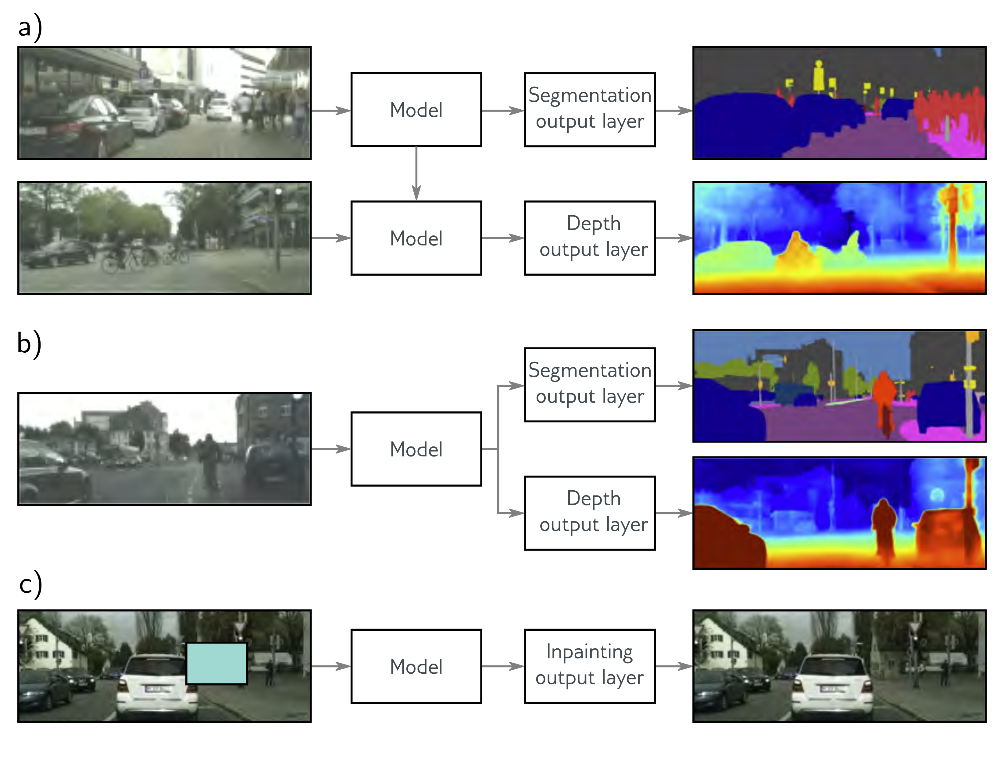

**Figure 1**

  

  <strong>Figure 9.12</strong> Transfer, multi-task, and self-supervised learning. a) Transfer learning is used when we have limited labeled data for the primary task (here depth estimation) but plentiful data for a secondary task (here segmentation). We train a model for the secondary task, remove the final layers, and replace them with new layers appropriate to the primary task. We then train only the new layers or fine-tune the entire network for the primary task. The network learns a good internal representation from the secondary task that is then exploited for the primary task (here depth estimation). In multi-task learning, we train a model to perform multiple tasks simultaneously, hoping that performance on each will improve. c) In generative self-supervised learning, we remove part of the data and train the network to complete the missing information. Here, the task is to fill in (inpaint) a masked portion of the image. This permits transfer learning when no labels are available. Images from Cordts et al. (2016).

