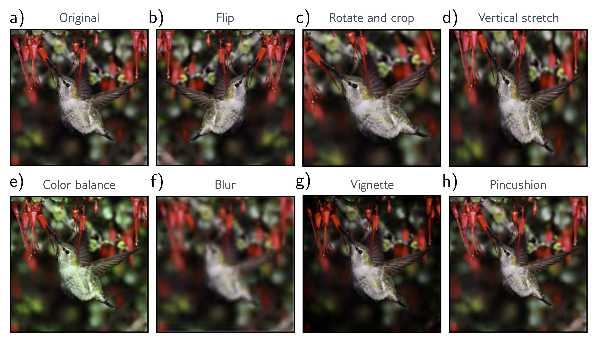

  

  <strong>Figure 9.13</strong> Data augmentation. For some problems, each data example can be transformed to augment the dataset. a) Original image. b-h) Various geometric and photometric transformations of this image. For image classification, all these images still have the same label, "bird." Adapted from Wu et al. (2015a).

Generating extra training data in this way is known as data augmentation. The aim is to teach the model to be indifferent to these irrelevant data transformations.

## 9.4 Summary

Explicit regularization involves adding an extra term to the loss function that changes the position of the minimum. The term can be interpreted as a prior probability over the parameters. Stochastic gradient descent with a finite step size does not neutrally descend to the minimum of the loss function. This bias can be interpreted as adding additional terms to the loss function, and this is known as implicit regularization.

There are also many heuristics for improving generalization, including early stopping, dropout, ensembling, the Bayesian approach, adding noise, transfer learning, multi-task learning, and data augmentation. There are four main principles behind these methods (figure 9.14). We can (i) encourage the function to be smoother (e.g., L2 regularization), (ii) increase the amount of data (e.g., data augmentation), (iii) combine models (e.g., ensembling), or (iv) search for wider minima (e.g., applying noise to network weights).
