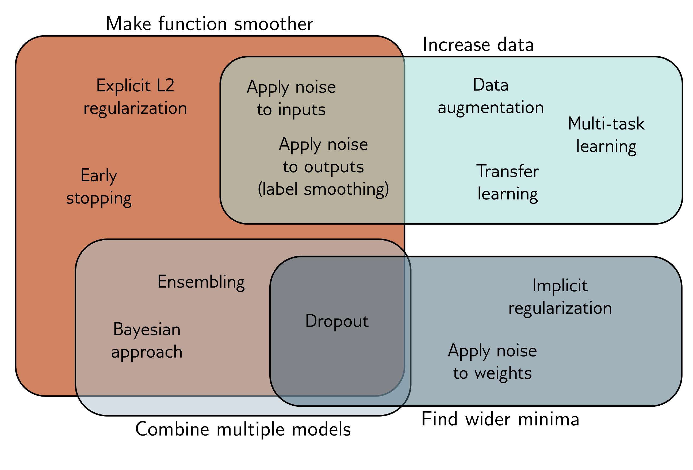

  

  <strong>Figure 9.14</strong> Regularization methods. The regularization methods discussed in this chapter aim to improve generalization by one of four mechanisms. Some methods aim to make the modeled function smoother. Other methods increase the effective amount of data. The third group of methods combine multiple models and hence mitigate against uncertainty in the fitting process. Finally, the fourth group of methods encourages the training process to converge to a wide minimum where small errors in the estimated parameters are less important (see also figure 20.11).

Another way to improve generalization is to choose the model architecture to suit the task. For example, in image segmentation, we can share parameters within the model, so we don’t need to independently learn what a tree looks like at every image location. Chapters 10–13 consider architectural variations designed for different tasks.

## Notes

An overview and taxonomy of regularization techniques in deep learning can be found in Kukačka et al. (2017). Notably missing from the discussion in this chapter is BatchNorm (Szegedy et al., 2016) and its variants, which are described in chapter 11.

Regularization: L2 regularization penalizes the sum of squares of the network weights. This encourages the output function to change slowly (i.e., become smoother) and is the most used regularization term. It is sometimes referred to as Frobenius norm regularization as it penalizes the Frobenius norms of the weight matrices. It is often also mistakenly referred to as “weight decay,” although this is a separate technique devised by Hanson & Pratt (1988) in which the parameters  $\phi$  are updated as:

$$
\begin{aligned}
\phi\leftarrow(1-\lambda^{\prime})\phi-\alpha\frac{\partial L}{\partial\phi},
\end{aligned} \quad (9.13)
$$
