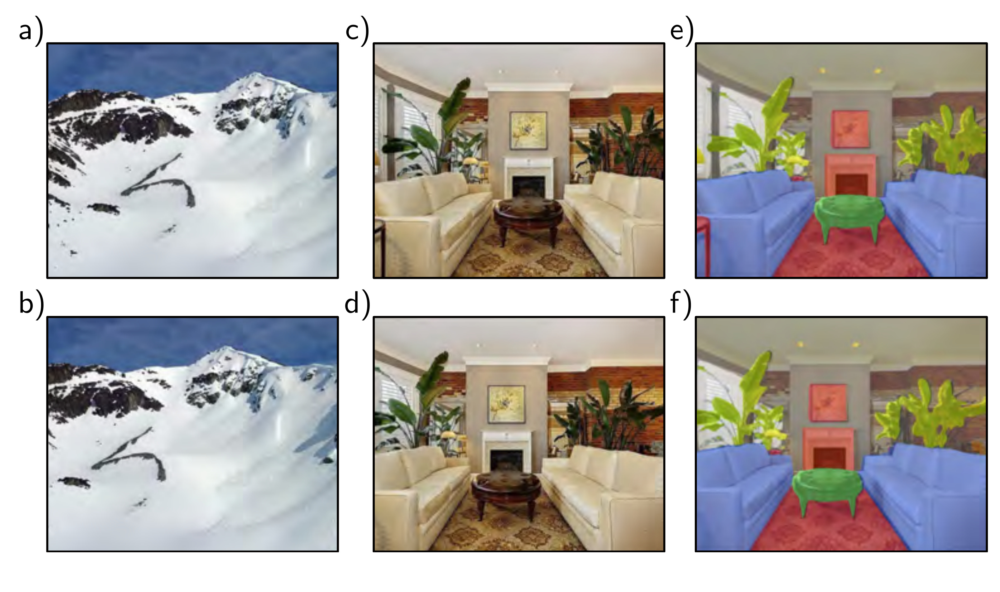

  

  <strong>Figure 10.1</strong> Invariance and equivariance for translation. a–b) In image classification, the goal is to categorize both images as “mountain” regardless of the horizontal shift that has occurred. In other words, we require the network prediction to be invariant to translation. c,e) The goal of semantic segmentation is to associate a label with each pixel. d,f) When the input image is translated, we want the output (colored overlay) to translate in the same way. In other words, we require the output to be equivariant with respect to translation. Panels c–f) adapted from Bousselham et al. (2021).

function f[x] of an image x is invariant to a transformation t[x] if:

$$
\mathbf{f}[\mathbf{t}[\mathbf{x}]] = \mathbf{f}[\mathbf{x}]\qquad (10.1)
$$

In other words, the output of the function f[x] is the same regardless of the transformation t[x]. Networks for image classification should be invariant to geometric transformations of the image (figure 10.1a–b). The network f[x] should identify an image as containing the same object, even if it has been translated, rotated, flipped, or warped.

A function f[x] of an image x is equivariant or covariant to a transformation t[x] if:

$$
\mathbf{f}[\mathbf{t}[\mathbf{x}]] = \mathbf{t}\left[\mathbf{f}[\mathbf{x}]\right]\qquad (10.2)
$$

In other words, f[x] is equivariant to the transformation t[x] if its output changes in the same way under the transformation as the input. Networks for per-pixel image segmentation should be equivariant to transformations (figure 10.1c–f); if the image is translated, rotated, or flipped, the network f[x] should return a segmentation that has been transformed in the same way.
