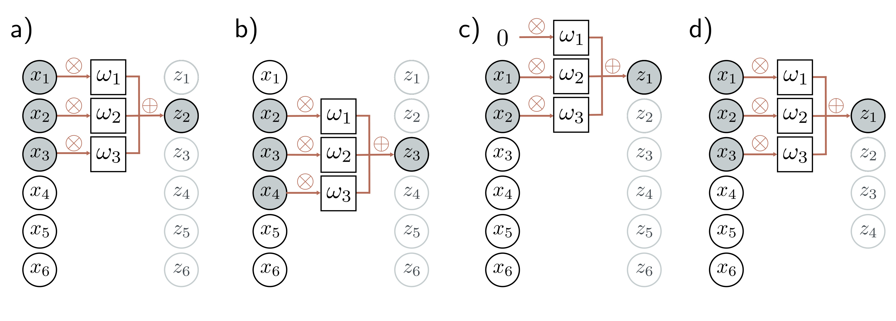

  

  <strong>Figure 10.2</strong> 1D convolution with kernel size three. Each output $z\_{i}$ is a weighted sum of the nearest three inputs $x\_{i-1}$, $x\_{i}$, and $x\_{i+1}$, where the weights are $\omega = [\omega\_1, \omega\_2, \omega\_3]$. a) Output $z\_{2}$ is computed as $z\_{2} = \omega\_1 x\_1 + \omega\_2 x\_2 + \omega\_3 x\_3$. b) Output $z\_{3}$ is computed as $z\_{3} = \omega\_1 x\_2 + \omega\_2 x\_3 + \omega\_3 x\_4$. c) At position $z\_{1}$, the kernel extends beyond the first input $x\_1$. This can be handled by zero-padding, in which we assume values outside the input are zero. The final output is treated similarly. d) Alternatively, we could only compute outputs where the kernel fits within the input range (“valid” convolution); now, the output will be smaller than the input.

## 10.2 Convolutional networks for 1D inputs

Convolutional networks consist of a series of convolutional layers, each of which is equivariant to translation. They also typically include pooling mechanisms that induce partial invariance to translation. For clarity of exposition, we first consider convolutional networks for 1D data, which are easier to visualize. In section 10.3, we progress to 2D convolution, which can be applied to image data.

## 10.2.1 1D convolution operation

Convolutional layers are network layers based on the convolution operation. In 1D, a convolution transforms an input vector x into an output vector z so that each output $z\_{i}$ is a weighted sum of nearby inputs. The same weights are used at every position and are collectively called the convolution kernel or filter. The size of the region over which inputs are combined is termed the kernel size. For a kernel size of three, we have:

$$
z_i = \omega_1 x_{i-1} + \omega_2 x_i + \omega_3 x_{i+1}\qquad (10.3)
$$

where $\omega = [\omega\_{1}, \omega\_{2}, \omega\_{3}]^{T}$ is the kernel (figure 10.2).[^1] Notice that the convolution operation is equivariant with respect to translation. If we translate the input $x$, then the corresponding output $z$ is translated in the same way.
