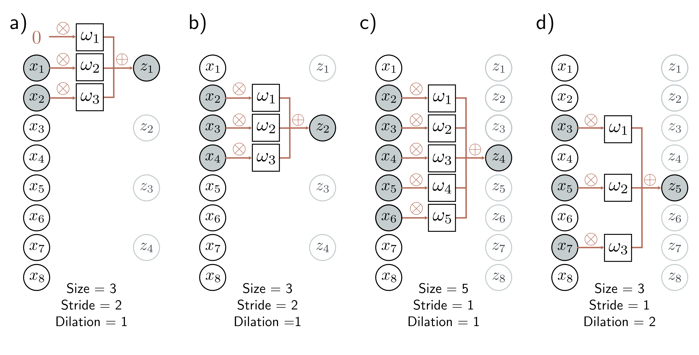

  

  <strong>Figure 10.3</strong> Stride, kernel size, and dilation. a) With a stride of two, we evaluate the kernel at every other position, so the first output $z_{1}$ is computed from a weighted sum centered at $x_{1}$ , and b) the second output $z_{2}$ is computed from a weighted sum centered at $x_{3}$ and so on. c) The kernel size can also be changed. With a kernel size of five, we take a weighted sum of the nearest five inputs. d) In dilated or atrous convolution (from the French “à trous” – with holes), we intersperse zeros in the weight vector to allow us to combine information over a large area using fewer weights.

## 10.2.2 Padding

Equation 10.3 shows that each output is computed by taking a weighted sum of the previous, current, and subsequent positions in the input. This begs the question of how to deal with the first output (where there is no previous input) and the final output (where there is no subsequent input).

There are two common approaches. The first is to pad the edges of the inputs with new values and proceed as usual. Zero-padding assumes the input is zero outside its valid range (figure 10.2c). Other possibilities include treating the input as circular or reflecting it at the boundaries. The second approach is to discard the output positions where the kernel exceeds the range of input positions. These valid convolutions have the advantage of introducing no extra information at the edges of the input. However, they have the disadvantage that the representation decreases in size.

## 10.2.3 Stride, kernel size, and dilation

In the example above, each output was a sum of the nearest three inputs. However, this is just one of a larger family of convolution operations, the members of which are
