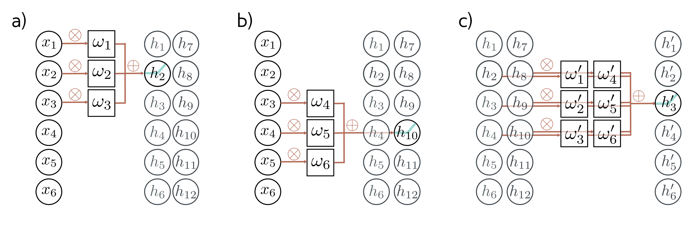

  

  <strong>Figure 10.4</strong> Fully connected vs. convolutional layers. a) A fully connected layer has a weight connecting each input x to each hidden unit h (colored arrows) and a bias for each hidden unit (not shown). b) Hence, the associated weight matrix $\Omega$ contains 36 weights relating the six inputs to the six hidden units. c) A convolutional layer with kernel size three computes each hidden unit as the same weight sum of the three neighboring inputs (arrows) plus a bias (not shown). d) The weight matrix is a special case of the fully connected matrix where many weights are zero and others are repeated (same colors indicate same value, white indicates zero weight). e) A convolutional layer with kernel size three and stride two computes a weighted sum at every other position. f) This is also a special case of a fully connected network with a different sparse weight structure.

  

  <strong>Figure 10.5</strong> Channels. Typically, multiple convolutions are applied to the input x and stored in channels. a) A convolution is applied to create hidden units $h_{1}$ to $h_{6}$ , which form the first channel. b) A second convolution operation is applied to create hidden units $h_{7}$ to $h_{12}$ , which form the second channel. The channels are stored in a 2D array $H_{1}$ that contains all the hidden units in the first hidden layer. c) If we add a further convolutional layer, there are now two channels at each input position. Here, the 1D convolution defines a weighted sum over both input channels at the three closest positions to create each new output channel.

