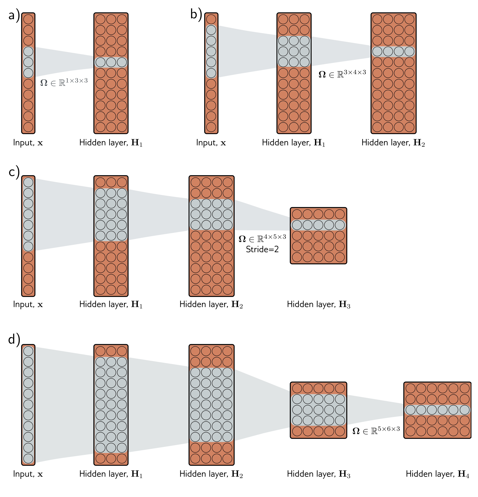

  

  <strong>Figure 10.6</strong> Receptive fields for network with kernel width of three. a) An input with eleven dimensions feeds into a hidden layer with three channels and convolution kernel of size three. The pre-activations of the three highlighted hidden units in the first hidden layer $H\_{1}$ are different weighted sums of the nearest three inputs, so the receptive field size to seven. d) By the time we add a fourth layer, the receptive field of the hidden units at position three have a receptive field that covers the entire input.

