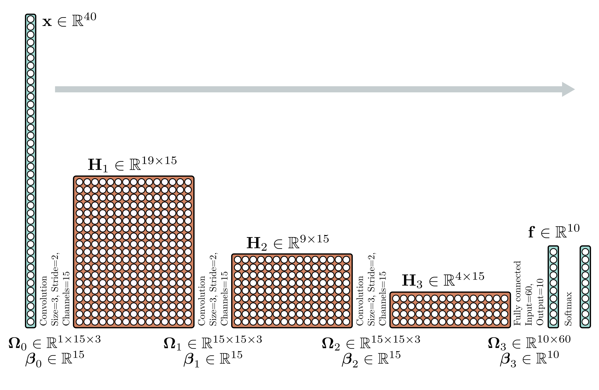

  

  <strong>Figure 10.7</strong> Convolutional network for classifying MNIST-1D data (see figure 8.1). The MNIST-1D input has dimension $D\_{i} = 40$ . The first convolutional layer has fifteen channels, kernel size three, stride two, and only retains “valid” positions to make a hidden layer with nineteen positions and fifteen channels. The following two convolutional layers have the same settings, gradually reducing the representation size at each subsequent hidden layer. Finally, a fully connected layer takes all sixty hidden units from the third hidden layer. It outputs ten activations that are subsequently passed through a softmax layer to produce the ten class probabilities.

  

  <strong>Figure 10.8</strong> MNIST-1D results. a) The convolutional network from figure 10.7 eventually fits the training data perfectly and has $\sim$ 17% test error. b) A fully connected network with the same number of hidden layers and the number of hidden units in each learns the training data faster but fails to generalize well with $\sim$ 40% test error. The latter model can reproduce the convolutional model but fails to do so. The convolutional structure restricts the possible mappings to those that process every position similarly, and this restriction improves performance.

