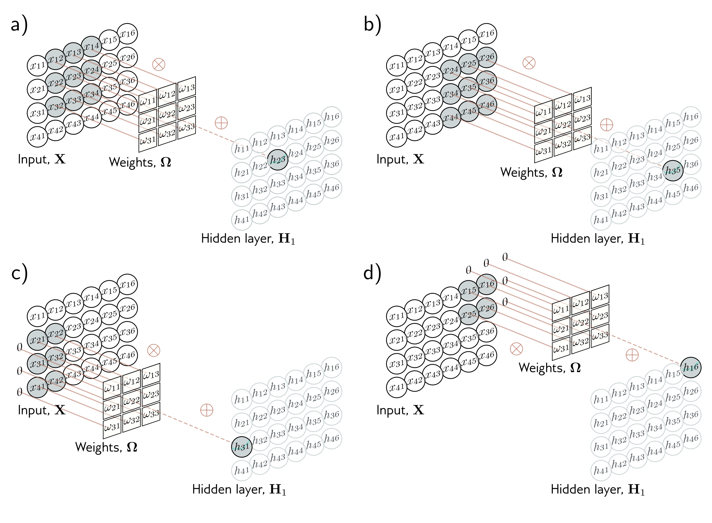

  

  <strong>Figure 10.9</strong> 2D convolutional layer. Each output $h\_{ij}$ computes a weighted sum of the 3×3 nearest inputs, adds a bias, and passes the result through an activation function. a) Here, the output $h\_{23}$ (shaded output) is a weighted sum of the nine positions from $x\_{12}$ to $x\_{34}$ (shaded inputs). b) Different outputs are computed by translating the kernel across the image grid in two dimensions. c–d) With zero-padding, positions beyond the image’s edge are considered to be zero.

## 10.4 Downsampling and upsampling

The network in figure 10.7 increased receptive field size by scaling down the representation at each layer using stride two convolutions. We now consider methods for scaling down or downsampling 2D input representations. We also describe methods for scaling them back up (upsampling), which is useful when the output is also an image. Finally, we consider methods to change the number of channels between layers. This is helpful when recombining representations from two branches of a network (chapter 11).

## 10.4.1 Downsampling

There are three main approaches to scaling down a 2D representation. Here, we consider the most common case of scaling down both dimensions by a factor of two. First, we
